# PetStop 

**Código da Disciplina**: FGA0208 
**Número do Grupo**: 03 

## Alunos

| Foto | Matrícula | Nome | GitHub |
|:--:|:--:|:--:|:--:|
| 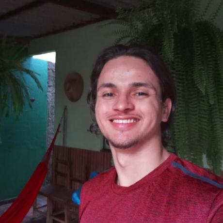| 18/0030272 | Antônio Ruan Moura Barreto| [@RuanMoura](https://github.com/RuanMoura) 
| 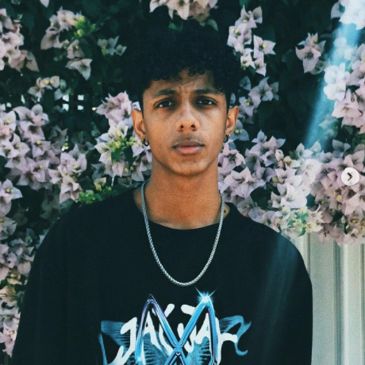| 18/0030345 | Arthur Manuel Florêncio Sena | [@senaarth](https://github.com/senaarth) 
| | 17/0032591 | Edvan Gomes | [@eddie-gomes](https://github.com/eddie-gomes) 
| | 18/0052845 | Gabriela da Gama Pivetta | [@gabrielapivetta](https://github.com/gabrielapivetta) 
| 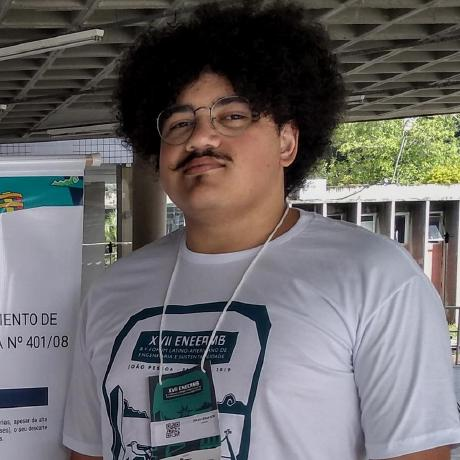| 16/0032903 | Júlio César Schneider Martins | [@jschneiderm98](https://github.com/jschneiderm98) 
| 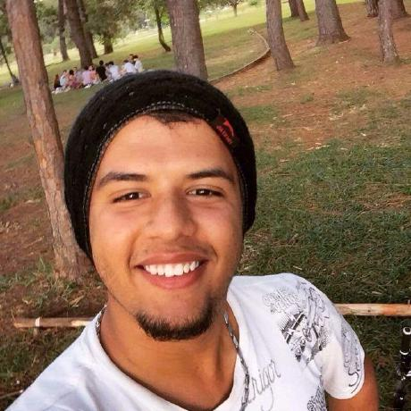| 17/0122549 | Paulo Gonçalves Lima | [@PauloGoncalvesLima](https://github.com/PauloGoncalvesLima) 
| | 17/0113060 | Pedro Vítor de Salles Cella | [@pedro-cella](https://github.com/pedro-cella) 
| | 17/0045269  | Sara Campos | [@saracampss](https://github.com/saracampss) 
| | 18/0028324 | Thiago Luiz de Souza Gomes | [@thiagomesUNB](https://github.com/thiagomesUNB) 
| 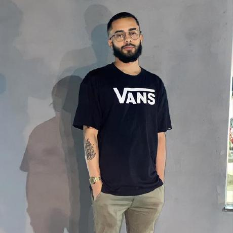| 18/0028685 | Victor Samuel dos Santos Lucas| [@victordsantoss](https://github.com/victordsantoss) 
| | 17/0115500 | Vinícius Vieira de Souza | [@faco400](https://github.com/faco400) 

## Sobre ([documentação](https://unbarqdsw2021-1.github.io/2021.1_G3_PetStop_docs/))

O PetStop é uma Plataforma Web de fácil acesso, que desenvolvida por estudantes da Faculdade do Gama - FGA, visa ser um mecanismo de união entre prestadores de atividades voluntárias e donos de animais domésticos de pequeno porte. Nosso objetivo é disponibilizar a prestação de serviços com um preço acessível ou de forma gratuita, ocorrendo por meio de eventos beneficentes aos finais de semana que disponibilizam cuidados básicos, feiras de adoção e doações diversas, visando principalmente populações carentes das regiões administrativas do Distrito Federal.

## Screenshots Primeira Entrega <<FOCO: DSW(Base)>>

### Protótipo

### Rich Picture
<iframe style="border: 1px solid rgba(0, 0, 0, 0.1);" width="800" height="450" src="https://www.figma.com/embed?embed_host=share&url=https%3A%2F%2Fwww.figma.com%2Ffile%2FViqHT2jZSLtXBDsJ7DFVVw%2FRichpicture%3Fnode-id%3D0%253A1" allowfullscreen></iframe>

### StoryBoard

### Causa e Efeito - Sucesso

### Causa e Efeito - Fracasso

### BPMN versão 2

## Vídeo(s) Primeira Entrega <<FOCO: DSW(Base)>>
https://drive.google.com/file/d/1s6C7L65R517N8h6CABqgup6tIsr6Dxj5/view?usp=sharing

## Screenshots Segunda Entrega <<FOCO: DSW(Modelagem)>>

### Diagrama de Pacotes
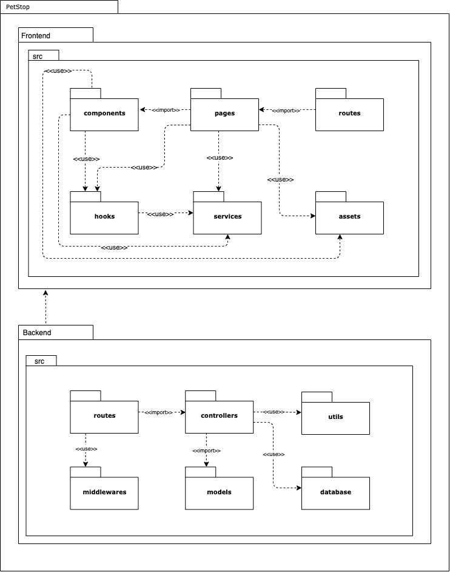

### Diagrama de Atividades
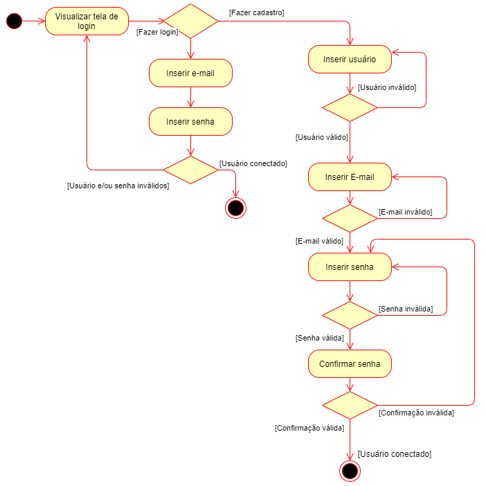

### Diagrama de Comunicação
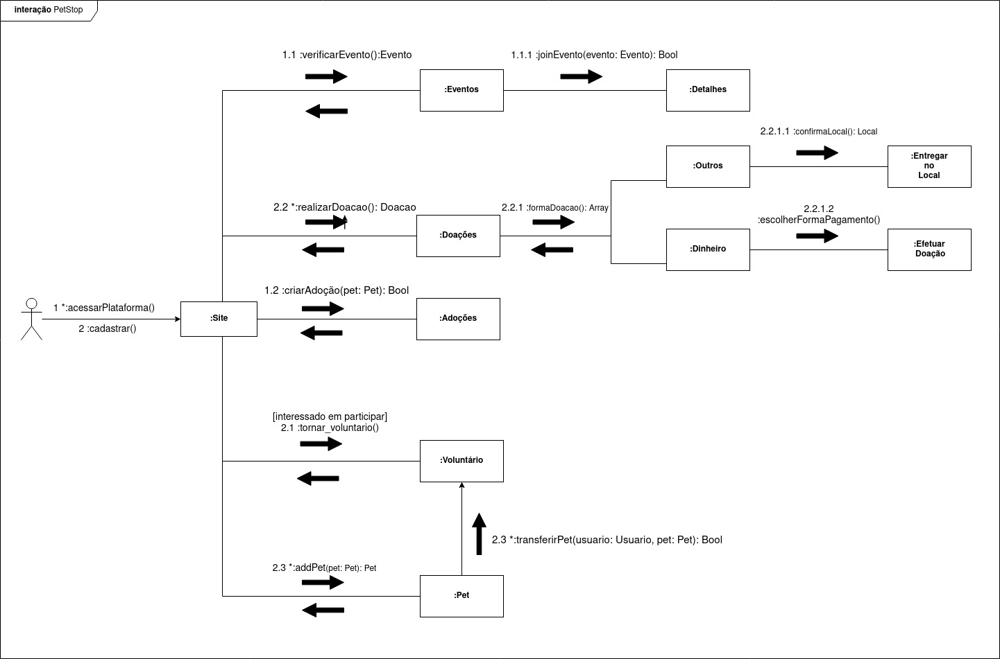

### Diagrama de Estado
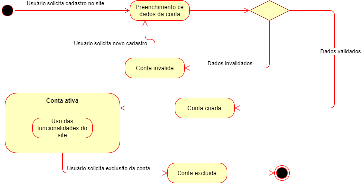

### DER
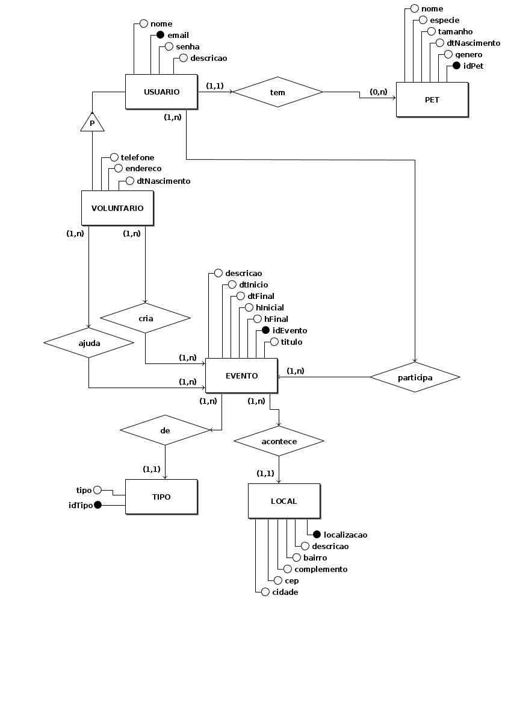

## Vídeo(s) Segunda Entrega <<FOCO: DSW(Modelagem)>>
https://drive.google.com/file/d/1-YvOTz77LuzXzfbfebm3dp7mOAN38tWj/view?usp=sharing

## Screenshots Terceira Entrega <<FOCO: DSW(Padrões de Projeto)>>

### Grasp Especialista 
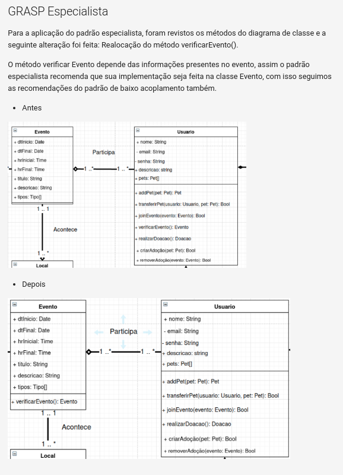

### Grasp Controlador
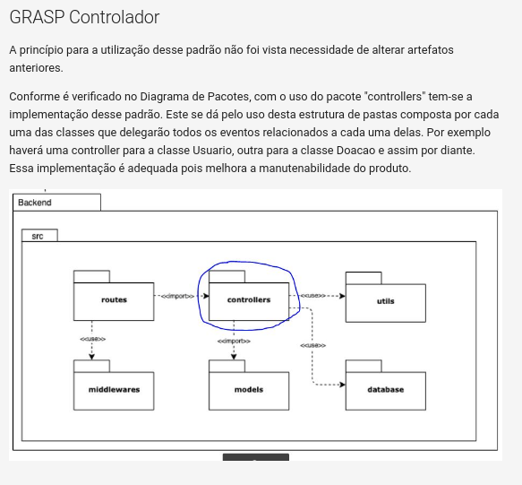

### Grasp Indireção
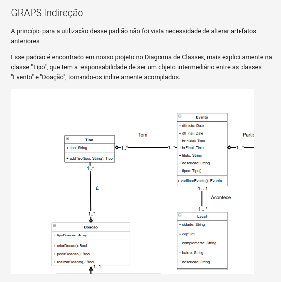

### GoF Criacional - Singleton 
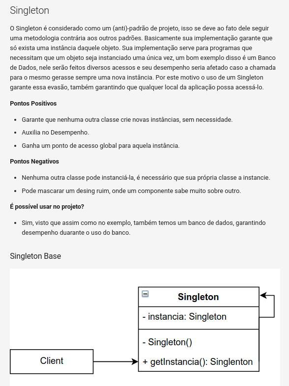

### GoF Estrutural - Adapter 
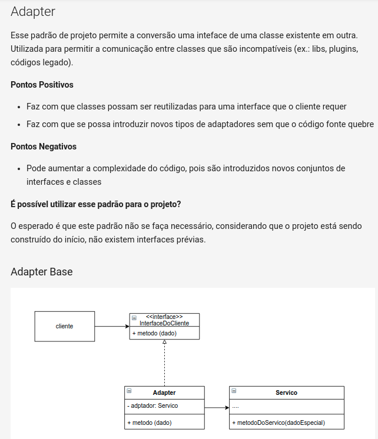

### GoF Comportamental - Strategy 
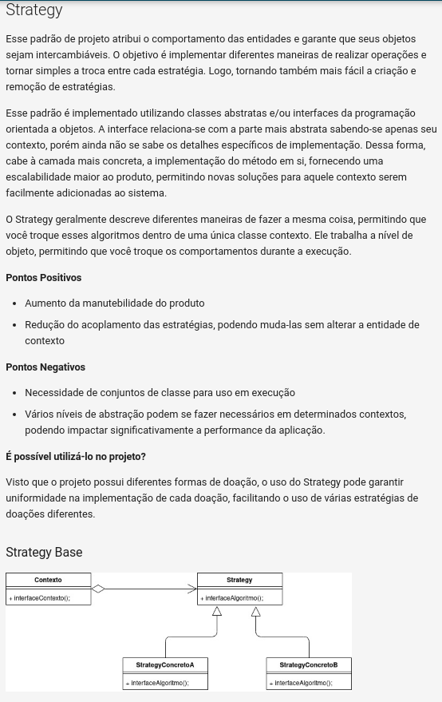

### Padrão Extra - React Provider Pattern
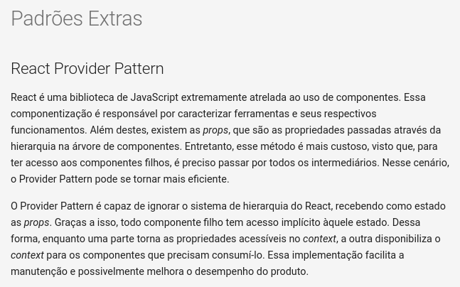

## Vídeo(s) Terceira Entrega <<FOCO: DSW(Padrões de Projeto)>>
https://drive.google.com/drive/folders/1BXR8_Pt_rSLSdFHpmWW38HRj_L2EGEDz

## Screenshots Quarta Entrega (FINAL) <<FOCOS: Arquitetura & Reutilização de Software & PROJETO FINAL>>

### Página Inicial

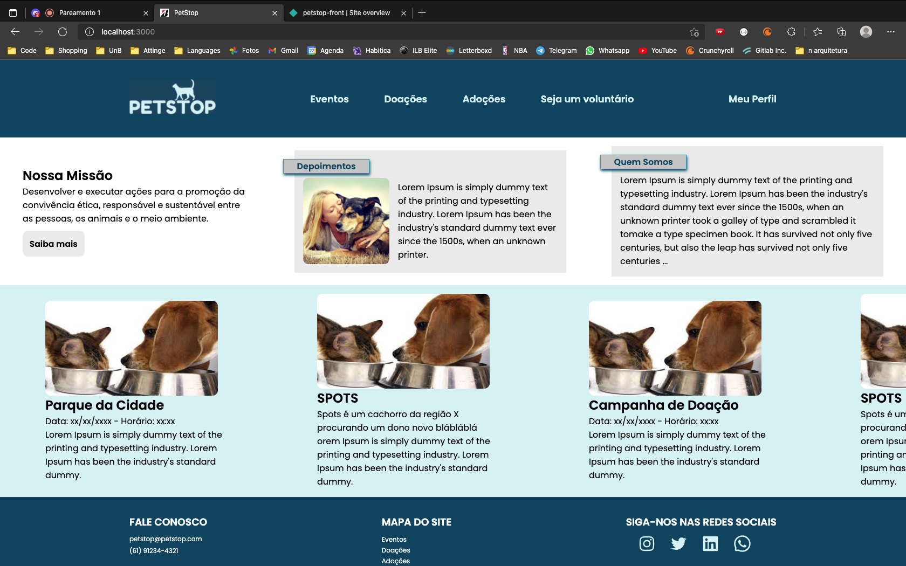

### Página de Eventos

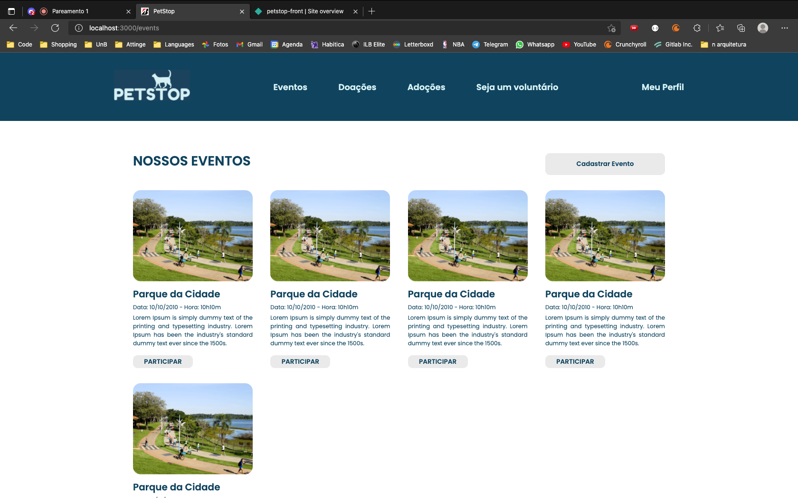

### Página de Autenticação

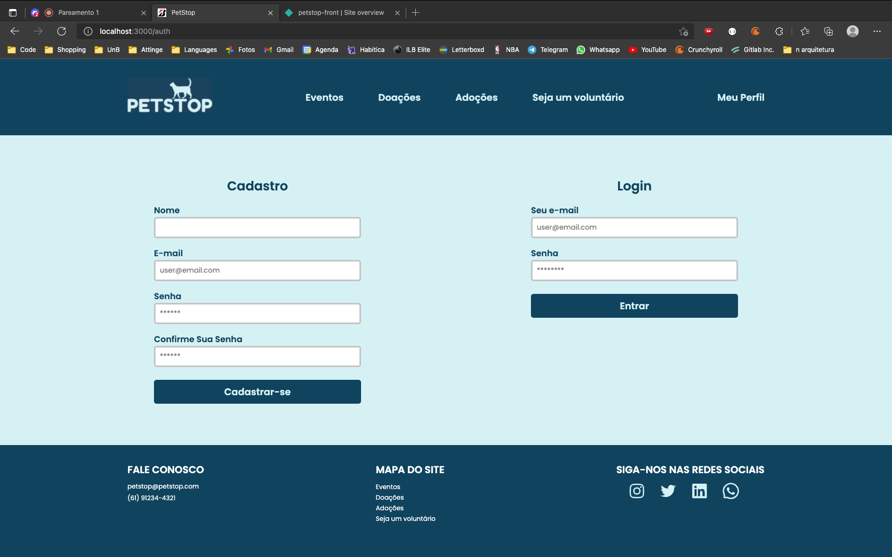

## Vídeo(s) Quarta Entrega (FINAL) <<FOCOS: Arquitetura & Reutilização de Software & PROJETO FINAL>>
[DAS](https://drive.google.com/file/d/1m4PnastB0mpqFPZnvG2pbBlHmlDygBEM/view)

[Reutilização](https://drive.google.com/file/d/1s3fdtpu6ArkKIv47RzFtgd1kHBHgP85e/view)

## Descritivo dos Principais Aspectos Técnicos 
**Principal(is) Metodologia(s) Adotada(s)**: Scrum e XP 
**Principais Linguagens Utilizadas e/ou Pretendidas**: Typescript e SQL 
**Principais Tecnologias Utilizadas e/ou Pretendidas**: Docker, Postgres, Node (Backend) e React (Frontend) 
**Principal(is) Estilo(s) Arquitetural(is) Adotado(s)**: MVC 

## O Projeto está rodando?
Sim, o código da aplicação, assim como uma descrição de como rodá-lo pode ser encontrado nos links

[Backend](https://github.com/UnBArqDsw2021-1/2021.1_G3_PetStop_backend)

[Frontend](https://github.com/UnBArqDsw2021-1/2021.1_G3_PetStop_frontend)

Os links de deploy são:

[Backend](https://petstop-backend.herokuapp.com/)

[Frontend](https://petstop-front.netlify.app)

