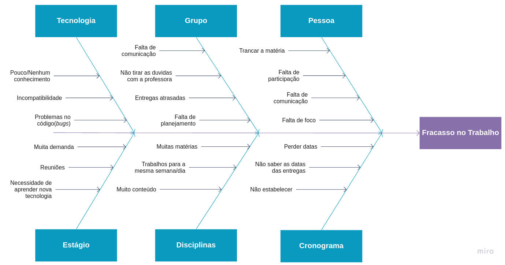

# PetStop 

**Código da Disciplina**: FGA0208 
**Número do Grupo**: 03 

## Alunos

| Matrícula | Aluno | GitHub |
| -- | -- | -- |
| 18/0030345  |  Arthur Manuel Florêncio Sena | @senaarth |
| 17/0115500  |  Vinícius Vieira de Souza | @faco400 |
| 18/0030272  |  Antonio Ruan Moura Barreto | @RuanMoura |
| 18/0028685  |  Victor Samuel dos Santos Lucas | @victordsantoss |
| 18/0028324  |  Thiago Luiz de Souza Gomes | @thiagomesUNB |
| 17/0122549  |  Paulo Gonçalves Lima | @PauloGoncalvesLima |
| 17/0113060  |  Pedro Vítor de Salles Cella | @pedro-cella |
| 18/0052845  |  Gabriela da Gama Pivetta | @gabrielapivetta |
| 16/0032903  |  Júlio César Schneider Martins | @jschneiderm98 |
| 17/0045269  |  Sara Campos | @saracampss |
| 17/0032591  |  Edvan Gomes | @eddie-gomes |

## Sobre ([documentação](https://unbarqdsw2021-1.github.io/2021.1_G3_PetStop_docs/))

O projeto se trata de uma aplicação web que tem como seu principal objetivo a organização de eventos de prestação de serviços voluntários para pets.

## Screenshots Primeira Entrega <<FOCO: DSW(Base)>>

### Protótipo

### Rich Picture

### StoryBoard

### Causa e Efeito - Sucesso

### Causa e Efeito - Fracasso

### BPMN versão 2

## Vídeo(s) Primeira Entrega <<FOCO: DSW(Base)>>
https://drive.google.com/file/d/1s6C7L65R517N8h6CABqgup6tIsr6Dxj5/view?usp=sharing

<!--
## Screenshots Segunda Entrega <<FOCO: DSW(Modelagem)>>
Adicione 2 ou mais screenshots do projeto em termos de artefatos da Segunda Entrega.

## Vídeo(s) Segunda Entrega <<FOCO: DSW(Modelagem)>>
Adicione o(s)s vídeo(s) da Segunda Entrega.

## Screenshots Terceira Entrega <<FOCO: DSW(Padrões de Projeto)>>
Adicione 2 ou mais screenshots do projeto em termos de artefatos da Terceira Entrega.

## Vídeo(s) Terceira Entrega <<FOCO: DSW(Padrões de Projeto)>>
Adicione o(s)s vídeo(s) da Terceira Entrega.

## Screenshots Quarta Entrega (FINAL) <<FOCOS: Arquitetura & Reutilização de Software & PROJETO FINAL>>
Adicione 2 ou mais screenshots do projeto em termos de interface e/ou funcionamento.

## Vídeo(s) Quarta Entrega (FINAL) <<FOCOS: Arquitetura & Reutilização de Software & PROJETO FINAL>>
Adicione o(s)s vídeo(s) da Entrega Final.

## Descritivo dos Principais Aspectos Técnicos 
**Principal(is) Metodologia(s) Adotada(s)**: xxxxxx 
**Principais Linguagens Utilizadas e/ou Pretendidas**: xxxxxx 
**Principais Tecnologias Utilizadas e/ou Pretendidas**: xxxxxx 
**Principal(is) Estilo(s) Arquitetural(is) Adotado(s)**: xxxxxx 

## O Projeto está rodando?
( ) SIM
( ) NÃO
Se SIM, insira um manual (ou um script) para auxiliar ainda mais os interessados em consultar o projeto.

## Informações Complementares 
Quaisquer outras informações sobre seu projeto podem ser descritas nessa seção.
-->