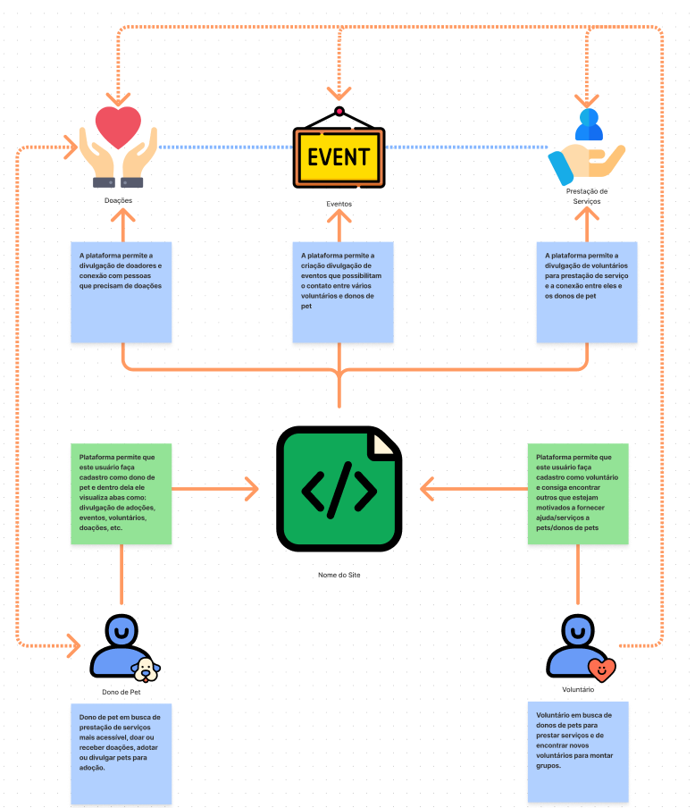

# PetStop 

**Código da Disciplina**: FGA0208 
**Número do Grupo**: 03 

## Alunos

| Foto | Matrícula | Nome | GitHub |
|:--:|:--:|:--:|:--:|
| | 18/0030272 | Antônio Ruan Moura Barreto| [@RuanMoura](https://github.com/RuanMoura) 
| | 18/0030345 | Arthur Manuel Florêncio Sena | [@senaarth](https://github.com/senaarth) 
| | 17/0032591 | Edvan Gomes | [@eddie-gomes](https://github.com/eddie-gomes) 
| | 18/0052845 | Gabriela da Gama Pivetta | [@gabrielapivetta](https://github.com/gabrielapivetta) 
| | 16/0032903 | Júlio César Schneider Martins | [@jschneiderm98](https://github.com/jschneiderm98) 
| | 17/0122549 | Paulo Gonçalves Lima | [@PauloGoncalvesLima](https://github.com/PauloGoncalvesLima) 
| | 17/0113060 | Pedro Vítor de Salles Cella | [@pedro-cella](https://github.com/pedro-cella) 
| | 17/0045269  | Sara Campos | [@saracampss](https://github.com/saracampss) 
| | 18/0028324 | Thiago Luiz de Souza Gomes | [@thiagomesUNB](https://github.com/thiagomesUNB) 
| | 18/0028685 | Victor Samuel dos Santos Lucas| [@victordsantoss](https://github.com/victordsantoss) 
| | 17/0115500 | Vinícius Vieira de Souza | [@faco400](https://github.com/faco400) 

## Sobre ([documentação](https://unbarqdsw2021-1.github.io/2021.1_G3_PetStop_docs/))

O PetStop é uma Plataforma Web de fácil acesso, que desenvolvida por estudantes da Faculdade do Gama - FGA, visa ser um mecanismo de união entre prestadores de atividades voluntárias e donos de animais domésticos de pequeno porte. Nosso objetivo é disponibilizar a prestação de serviços com um preço acessível ou de forma gratuita, ocorrendo por meio de eventos beneficentes aos finais de semana que disponibilizam cuidados básicos, feiras de adoção e doações diversas, visando principalmente populações carentes das regiões administrativas do Distrito Federal.

## Screenshots Primeira Entrega <<FOCO: DSW(Base)>>

### Protótipo

### Rich Picture

### StoryBoard

### Causa e Efeito - Sucesso

### Causa e Efeito - Fracasso

### BPMN versão 2

## Vídeo(s) Primeira Entrega <<FOCO: DSW(Base)>>
https://drive.google.com/file/d/1s6C7L65R517N8h6CABqgup6tIsr6Dxj5/view?usp=sharing

<!--
## Screenshots Segunda Entrega <<FOCO: DSW(Modelagem)>>
Adicione 2 ou mais screenshots do projeto em termos de artefatos da Segunda Entrega.

## Vídeo(s) Segunda Entrega <<FOCO: DSW(Modelagem)>>
Adicione o(s)s vídeo(s) da Segunda Entrega.

## Screenshots Terceira Entrega <<FOCO: DSW(Padrões de Projeto)>>
Adicione 2 ou mais screenshots do projeto em termos de artefatos da Terceira Entrega.

## Vídeo(s) Terceira Entrega <<FOCO: DSW(Padrões de Projeto)>>
Adicione o(s)s vídeo(s) da Terceira Entrega.

## Screenshots Quarta Entrega (FINAL) <<FOCOS: Arquitetura & Reutilização de Software & PROJETO FINAL>>
Adicione 2 ou mais screenshots do projeto em termos de interface e/ou funcionamento.

## Vídeo(s) Quarta Entrega (FINAL) <<FOCOS: Arquitetura & Reutilização de Software & PROJETO FINAL>>
Adicione o(s)s vídeo(s) da Entrega Final.

## Descritivo dos Principais Aspectos Técnicos 
**Principal(is) Metodologia(s) Adotada(s)**: xxxxxx 
**Principais Linguagens Utilizadas e/ou Pretendidas**: xxxxxx 
**Principais Tecnologias Utilizadas e/ou Pretendidas**: xxxxxx 
**Principal(is) Estilo(s) Arquitetural(is) Adotado(s)**: xxxxxx 

## O Projeto está rodando?
( ) SIM
( ) NÃO
Se SIM, insira um manual (ou um script) para auxiliar ainda mais os interessados em consultar o projeto.

## Informações Complementares 
Quaisquer outras informações sobre seu projeto podem ser descritas nessa seção.
-->