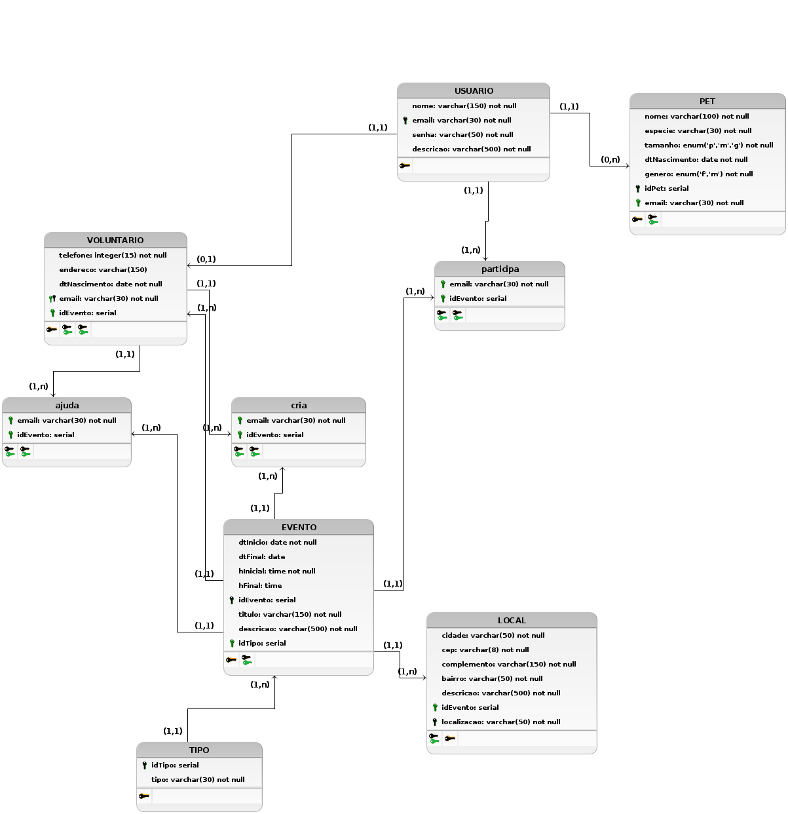

# Diagrama Entidade Relacionamento

O Modelo Entidade Relacionamento tem por finalidade modelar todo o banco de dados do sistema com suas respectivas tabelas e relacionamentos. Esse documento é composto por um MER (Modelo Entidade Relacionamento), DER (Diagrama Entidade Relacionamento), DL (Diagrama Lógico) e o seu respectivo Dicionário de Dados.

## Modelo Entidade Relacionamento (MER)

### Entidades

**USUARIO** (<u>email</u>,nome,senha, descricao)

**VOLUNTARIO** (email, telefone, endereco, dtNascimento)

**PET** (<u>idPet</u>, nome,especie,tamanho,genero,dtNascimento)

**TIPO** (<u>idTipo</u>, tipo)

**LOCAL** (descricao,bairro,complemento,cep,cidade)

**EVENTO** (<u>idEvento</u>,dtInicio,dtFinal,hInicial,hFinal,titulo)

### Relacionamentos

**USUARIO** - tem - **PET**

Um _USUARIO_ tem um ou vários _PET_ e um _PET_ pertence a um _USUARIO_

**Cardinalidade -> 1:n**

**USUARIO** - participa - **EVENTO** 
Um ou vários _USUARIO_  participam de um ou vários _EVENTO_ e um _EVENTO_ recebe um ou vários _USUARIO_

**Cardinalidade -> n:m**

**EVENTO** - acontece - **LOCAL** 
Um _EVENTO_ acontece em um _LOCAL_
e um _LOCAL_ recebe um ou vários _EVENTO_

**Cardinalidade -> 1:n**

**EVENTO** - de - **TIPO** 
Um _EVENTO_ é de um ou vários _TIPO_ e um _TIPO_ é de um ou vários _EVENTO_

**Cardinalidade -> n:m**

**VOLUNTARIO** - cria - **EVENTO** 
Um ou vários _VOLUNTARIO_  criam um ou vários _EVENTO_ e um _EVENTO_ é criado de um ou vários _VOLUNTARIO_

**Cardinalidade -> n:m**

**VOLUNTARIO** - ajuda - **EVENTO** 
Um ou vários _VOLUNTARIO_ ajudam em um ou vários _EVENTO_ e um _EVENTO_ recebe ajuda de um ou vários _VOLUNTARIO_

**Cardinalidade -> n:m**

## Diagrama Entidade Relacionamento (DER)

## Diagrama Lógico

## Dicionário de Dados

## Referências

- Software para Diagramação do Modelo Entidade Relacionamento - brModelo <http://www.sis4.com/brModelo/>. Último acesso em 17/08/2021

## Versionamentos

|Data|Versão|Descrição|Autor|
|:--------:|:---:|:-------------------: |:-----------------------:|
|17/08/2021| 0.1 | Criação do DER no BrModelo | Gabriela Pivetta, Paulo Gonçalves |
|18/08/2021| 0.2 | Criação do Documento | Thiago Luiz |  
|18/08/2021| 0.3 | Criação do MER | Thiago Luiz,Gabriela Pivetta, Paulo Gonçalves |
|18/08/2021| 0.4 | Criação do DLD | Thiago Luiz,Gabriela Pivetta, Paulo Gonçalves |
|18/08/2021| 0.5 | Atualização do Documento | Thiago Luiz,Gabriela Pivetta, Paulo Gonçalves |
|18/08/2021| 0.6 | Correção do atributo do VOLUNTARIO  e do markdown| Thiago Luiz,Gabriela Pivetta, Paulo Gonçalves |
|19/08/2021| 0.7 | Mudança nas entidades, v0.2 DER e DLD | Thiago Luiz,Gabriela Pivetta, Paulo Gonçalves |

