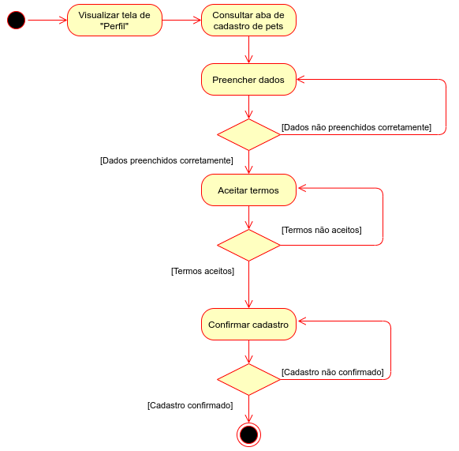
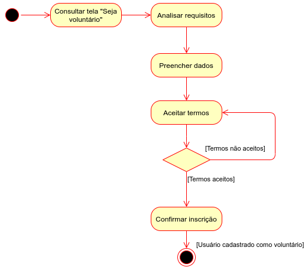
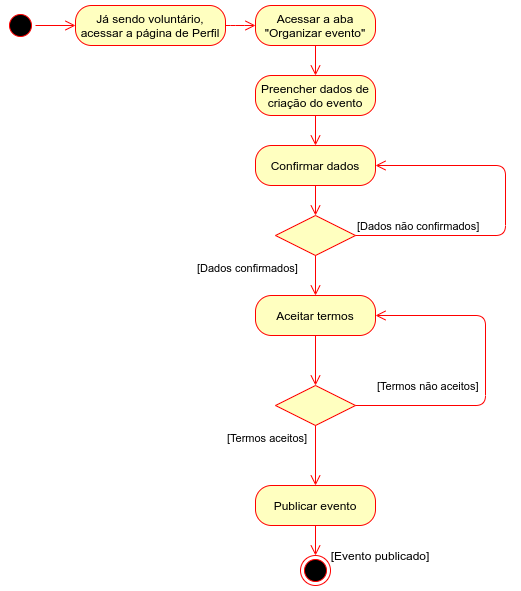

# Documento de Arquitetura de Software

<!--
    Diagrama de Classes, Sequencia, Pacotes, Componentes, Colab, Atividades, Visão de Casos de Uso, Dados, Contexto

    Não fizemos: Context, Casos de Uso
    Fizemos: Componentes, processos, dados
-->

## 1. Introdução

<!-- Finalidade Escopo -->

## 2. Padrão Arquitetural

<!-- MVC, exemplo model view e controller -->
<!-- Extra Middleware Pipeline -->

## 3. Representação Arquitetural

<!-- Diagrama de Contexto, texnologias -->

## 4. Objetivos Arquiteturais e Restrições

## 5. Visão de Casos de Uso

## 6. Visão Lógica

<!-- Classe, Componentes, Pacotes(?) -->

## 7. Visão de Processo

A visão de processos ilustra a decomposição do sistema em componentes ou conjutos de elementos que se comunicam e interagem em tempo de execução. Esses fluxos de processos de comunicação, bem como os objetos e mensagens trocadas entre eles podem ser vistos nos diagramas de Sequência e de Comunicação e são detalhados nos diagramas de Atividades e de Estados. Segue abaixo os diagramas de sequência e atividades para o acompanhamento dos principais processos da plataforma PetStop.

### Diagrama de Sequência

O iframe abaixo é interativo, possibilitando ao usuário dar zoom caso necessário.

<iframe frameborder="0" style="width:100%;height:25rem;" src="https://viewer.diagrams.net/?highlight=0000ff&edit=_blank&layers=1&nav=1&title=Diagrama_Sequ%C3%AAncia#Uhttps%3A%2F%2Fdrive.google.com%2Fuc%3Fid%3D1W0I4-NwEozkM1UQvEjn2z9sgut-EHgtJ%26export%3Ddownload"></iframe>

### Principais Processos

- **Processo de cadastro de pet:** A partir desse processo o usuário poderá realizar o cadastro de pets, fornecendo os dados referentes ao animal, e concordando com os termos de consentimento.

 

- **Processo de cadastro como voluntário:** Com um usuário já cadastrado poderá ser feita a solicitação para o mesmo se tornar voluntário.

- **Processo de criar e publicar evento:** Um usuário voluntário pode criar eventos e especificar seu(s) tipo(s), localização, descrição, data, horário, etc.

- **Processo de participar de um evento:** A partir da listagem dos eventos cadastrados, o usuário pode escolher um no qual deseja para participar, como voluntário ou não, dependendo do seu perfil.

## 8. Visão de Implantação

<!-- Devops -->

## 9. Visão de Implementação

<!-- Classes -->

## 10. Visão de Dados

<!-- Exemplos das models etc, DER, DLD -->

## Versionamentos

|    Data    | Versão |      Descrição       |                                               Autor                                               |
| :--------: | :----: | :------------------: | :-----------------------------------------------------------------------------------------------: |
| 05/10/2021 |  0.1   | Criação do Documento | Arthur Sena, Edvan Gomes, Pedro Vítor de Salles Cella, Sara Campos, Victor Samuel, Vinícius Souza |
| 05/10/2021 |  0.2   | Elaboração da Visão de Processo | Gabriela Pivetta, Vinícius Souza, Antonio Ruan |

