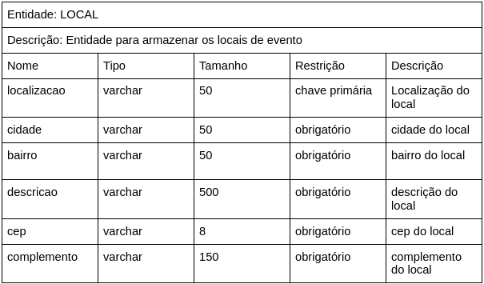

# Documento de Arquitetura de Software

<!--
    Diagrama de Classes, Sequencia, Pacotes, Componentes, Colab, Atividades, Visão de Casos de Uso, Dados, Contexto

    Não fizemos: Context, Casos de Uso
    Fizemos: Componentes, processos, dados
-->

## 1. Introdução

Padrões (ou estilos) de arquitetura são *templates* que visam solucionar problemas arquiteturais recorrentes. Cada padrão se divide em subconjuntos pré-definidos, os quais especificam as regras e diretrizes para organizar suas relações.

Um dos padrões tipicamente usados em aplicações web é o MVC (Model-View-Controller). Este padrão é normalmente aplicado quando existem várias maneiras de interação entre usuário e dados da aplicação.  

## 2. Padrão Arquitetural - MVC

O padrão MVC tem como principal característica a estruturação do sistema em três camadas lógicas, as quais interagem entre si.

- **Modelo** → contém a funcionalidade principal e os dados;
- **View** → exibe a informação aos usuários;
- **Controller** → gerencia a entrada do usuário, deixando o modelo transparente. 

Uma das vantagens do MVC é a possibilidade de alteração de dados de maneira independente de sua representação. Além disso, ele permite que o mesmo dado seja mostrado múltiplas vezes e de maneiras distintas, ou seja, uma model pode possuir mais de uma view. 

Dadas as vantagens desse modelo arquitetural somado a preferência da equipe, o MVC foi escolhido para ser o padrão que rege este projeto. 

<!-- MVC, exemplo model view e controller -->
<!-- Extra Middleware Pipeline -->

## 3. Representação Arquitetural

### 3.1 Tecnologias
#### 3.1.1 FrontEnd

   O framework <b>React</b> já era conhecido pela maioria dos integrantes da equipe e também possui grande comunidade ativa, o que permite o acesso rápido a conteúdos e treinamentos para aqueles que não possuiam desenvoltura com a tecnologia.

#### 3.1.2 BackEnd

<!-- mudar modelo para lista -->

    A tecnologia escolhida pelo grupo para o servidor do projeto foi o <b>Node</b>. Utilizado para executar JavaScript fora do navegador, este framework permite a criação de aplicações web em geral e se mostrou interessante para o grupo pelo mesmo motivo que o React e também para que aqueles que não tinham familiaridade com o desenvolvimento Web necessitassem do contato com apenas uma linguagem.

    O banco de dados do projeto utilizará do <b>Postgres</b>, um sistema de banco de dados Open Source de fácil instalação que possui interfaces simples e intuitivas que facilitam o processo de aprendizado.

#### 3.1.3 Outros

    O <b>Docker</b> se mostrou indispensável para o desenvolvimento do nosso projeto, já que a uniformização e contêinerização do ambiente de execução da equipe evita problemas que são mitigados por este empacotamento.

### 3.2 Diagrama de Contexto

O Diagrama de contexto representa de uma forma de mais alto nível a comunicação estabelecida entre as tecnologias, bem como o projeto em um contexto geral.

<iframe frameborder="0" style="width:100%;height:500px;" src="https://viewer.diagrams.net/?tags=%7B%7D&highlight=FFFFFFFF&edit=_blank&layers=1&nav=1&title=Diagrama%20de%20Contexto#Uhttps%3A%2F%2Fdrive.google.com%2Fuc%3Fid%3D13VTp-aDIl5Z-XHXIlwDf3uXGa_WIyTeu%26export%3Ddownload"></iframe>

## 4. Objetivos Arquiteturais e Restrições

| Objetivos | |
| :--- | --- |
| Deploy | O deploy da aplicação deve ser automatizado |
| Escalabilidade | A aplicação deve ser escalável |
| Segurança | A aplicação deve tratar de forma de segura os dados sensíveis dos usuários |
| Usabilidade | A aplicação deve ser intuitiva e interativa |

| Restrições | |
| :--- | --- |
| Conectividade | É necessário ter conexão com internet para acessar a aplicação |
| Linguagem | A linguagem padrão da aplicação é a Língua Portuguesa do Brasil |
| Plataforma | É necessário o uso de um navegador tanto em dispositivos desktop, quanto mobile |
| Público | Brasileiros que se interessam ou possuem necessidade envolvendo animais domésticos |
| Prazo | A aplicação há de ser finalizada até o fim da disciplina |
| Infraestrutura | Criar um sistema otimizado que não necessite de uma infraestrutura robusta para sustentar a aplicação |

## 5. Visão de Casos de Uso

Na linguagem de Modelagem Unificada (UML), o diagrama de caso de uso resume os detalhes dos usuários do seu sistema (Também chamados de atores) e as suas interações. Seu objetivo é demonstrar as diferentes maneiras que o usuário pode interagir com as funcionalidades de um determinado sistema, listando-as e representando-as de maneira centralizada e significativa para os cenários consideráveis, além de, definir e organizar os requisitos funcionais, especificiar o contexto e modelar os fluxos de eventos.

A visão de caso de uso é um aspecto arquitetônico que demonstra os casos e cenários de uso que abrangem comportamento e/ou classes significativas do ponto de vista arquitetônico. Essa visão mostra um subconjunto arquitetonicamente significativo dos casos de uso e atores, que no projeto PetStop são: Usuário e Voluntário.

Os casos de uso levantados podem ser visualizados em [Diagramas de Casos de Uso](../modelagem/umlDinamicos/casosDeUso.md) já o geral pode ser visto abaixo:

<iframe frameborder="0" style="width:100%;height:683px;" src="https://viewer.diagrams.net/?tags=%7B%7D&highlight=0000ff&edit=_blank&layers=1&nav=1&title=UC09%20-%20Sistema%20Geral#Uhttps%3A%2F%2Fdrive.google.com%2Fuc%3Fid%3D1gWePmfg94F6bJJASntIhqPLqP5Ynfoa0%26export%3Ddownload"></iframe>

## 6. Visão Lógica

O propósito da visão lógica é descrever as partes significativas do projeto do ponto de vista da arquitetura do modelo de design.

  
<!-- Componentes, Pacotes(?) -->
### 6.1 Diagrama de Componentes
O [Diagrama de Componentes](../modelagem/umlEstaticos/componentes.md) serve para demonstrar um funcionamento do software com maior detalhamento e suas partes específicas, abaixo tem-se o diagrama do projeto:

<iframe frameborder="0" style="width:100%;height:500px;" src="https://viewer.diagrams.net/?tags=%7B%7D&highlight=FFFF&edit=_blank&layers=1&nav=1&title=Diagrama_Componentes#Uhttps%3A%2F%2Fdrive.google.com%2Fuc%3Fid%3D1qb7gG-TzegixnUGcc7K_iEgqFBzxzjdx%26export%3Ddownload"></iframe>

### 6.2 Diagrama de Pacotes

Abaixo é disponibilizada a visualização da última versão do nosso <a href="https://unbarqdsw2021-1.github.io/2021.1_G3_PetStop_docs/modelagem/umlEstaticos/pacotes/">Diagrama de Pacotes</a>, artefato que permite visualizar a organização de diretórios e arquivos do projeto.

  
<iframe frameborder="0" style="width:100%;height:650px;" src="https://viewer.diagrams.net/?tags=%7B%7D&highlight=0000ff&edit=_blank&layers=1&nav=1&title=Diagrama%20de%20Pacotes%20-%20Detalhado#Uhttps%3A%2F%2Fdrive.google.com%2Fuc%3Fid%3D1_hAiu-3ojxPBdjDLXdze3OCvxcyUdxgN%26export%3Ddownload"></iframe>

## 7. Visão de Processo

A visão de processos ilustra a decomposição do sistema em componentes ou conjutos de elementos que se comunicam e interagem em tempo de execução. Esses fluxos de processos de comunicação, bem como os objetos e mensagens trocadas entre eles podem ser vistos nos diagramas de Sequência e de Comunicação e são detalhados nos diagramas de Atividades e de Estados. Segue abaixo os diagramas de sequência e atividades para o acompanhamento dos principais processos da plataforma PetStop.

  
### Diagrama de Sequência

O iframe abaixo é interativo, possibilitando ao usuário dar zoom caso necessário.

  
<iframe frameborder="0" style="width:100%;height:25rem;" src="https://viewer.diagrams.net/?highlight=0000ff&edit=_blank&layers=1&nav=1&title=Diagrama_Sequ%C3%AAncia#Uhttps%3A%2F%2Fdrive.google.com%2Fuc%3Fid%3D1W0I4-NwEozkM1UQvEjn2z9sgut-EHgtJ%26export%3Ddownload"></iframe>

### Principais Processos

- **Processo de cadastro de pet:** A partir desse processo o usuário poderá realizar o cadastro de pets, fornecendo os dados referentes ao animal, e concordando com os termos de consentimento.

 

- **Processo de cadastro como voluntário:** Com um usuário já cadastrado poderá ser feita a solicitação para o mesmo se tornar voluntário.

- **Processo de criar e publicar evento:** Um usuário voluntário pode criar eventos e especificar seu(s) tipo(s), localização, descrição, data, horário, etc.

- **Processo de participar de um evento:** A partir da listagem dos eventos cadastrados, o usuário pode escolher um no qual deseja para participar, como voluntário ou não, dependendo do seu perfil.

## 8. Visão de Implantação

Abaixo é possivel observar dois diagramas de implantação, o primeiro explicitando o caso de deploy da aplicação, já o segundo explicita os nós na execução da aplicação.

<iframe frameborder="0" style="width:100%;height:500px;" src="https://viewer.diagrams.net/?tags=%7B%7D&highlight=FFFF&edit=_blank&layers=1&nav=1&title=Diagrama%20de%20Implementa%C3%A7%C3%A3o#Uhttps%3A%2F%2Fdrive.google.com%2Fuc%3Fid%3D1cRA7a3SeV9I3VihfE0m-3jkn4RkcKQih%26export%3Ddownload"></iframe>

<iframe frameborder="0" style="width:100%;height:500px;" src="https://viewer.diagrams.net/?tags={}&highlight=0000ff&edit=_blank&layers=1&nav=1&title=Untitled%20Diagram.drawio#R7VnbctowEP0aHsPYkm3sx3BrZpLMZEpn2j51hC2MG2FRIQj067uyJV8wpNBAQifhQVjHK2m1e1bSyi3cm60%2FCTKf3vOIshayonUL91sI2djz4U8hmxzpBDgHYpFEWqgERslvqkFLo8skoouaoOScyWReB0OepjSUNYwIwZ%2FqYhPO6qPOSUwbwCgkrIl%2BTSI5zVHftUr8hibx1IxsW%2FrNjBhhDSymJOJPFQgPWrgnOJf502zdo0wZz9glbzfc87ZQTNBUHtIgin6Nbu9HP5zB59tBLOln13m80t5ZEbbUE24hj0F%2F3ShZwWOsHuGfzObwwJq16zlLQiITnkI3IypWVBQC9campjsZ1gfYHvOGCv64NC%2FGYlt0u4PMwnJj3AZqSNCLXbMkTgGSXKlAdI3RiWoFHpkr%2BXA5pqqakw%2BYpzQRwCY1K9xf8KVyZXfCUznSQyiZqZwxJa%2F048s0otHd2ACLOQmTNL7LBuq7hYpKL7re60G74AUEFOUzKsUGRHQDw6RNPUSeSl7aHY1NK5zEvgaJjoW46LmkCzxoxhzBnuCU7DkBaR4oOAg8fR7WhOAmYPfRvDmOJwsJxKc9zrjIlMIW%2FIbDQxm0P8qbtKoSx9lFHLOWCcrASav6kriLTXqMB56APgVv7TpvvS068slkQWWDjIWi%2F85PGzcIOliBqXjD8xUfRYLPvxARU6nj%2FOR23xPOHbeNfQxmd5y8bIa3vcNLDmoHHc8OLEeXzpmi3XZ2hPuWHU1ozHi0VFj3J5VyY3ZO3wDFlum8yL65f%2Fca2G4YEO2wHzoNya9Qp%2BbOzquRvLkKP%2BiRLozhCOO272DsBYGXlf5hDMdeu0Jvz0z45AQ36l4QwYMPgl%2Bh5iq%2BY%2B%2FvkjTkKtGgLTXhQ08AjX76cEpfHHheuISY8lHb9VwncFwrKw%2FcNNy2OhcGri7PtWegi9sz0MeeAUawG27pQXZDLpHhtu21A%2BT6nuVbWdl00dtSHF0cxZ9PI98Jxd2GF2gUU5PAcyGnPOYpYYMS7Yo8P9MEL2XuuMoEszDIHKXvqcgSUolaggeOEZtvqn27qH7X3WWV%2FrpW21RrD1QkMG2VY2owulZXWFBNeUpzZJgoO1QCUM1qLz80BKmoCOlzBw3tbWkCfJ%2FgngPJwSx5WQay64B21IVDV90InuiKqscSZeePK6rq2u3vzvX%2Ftlif7YoKeW%2BzDLxe5KL%2FInKbm2SfSDImC2oujd9jeNj%2B%2BeIDquXHhXxXLT%2FR4MEf"></iframe>

### 8.1. Diagrama de Classes

O Diagrama de Classes demonstra a forma como será feito a implementação do projeto, especificando as classes a serem criadas bem como seus atributos e métodos.

<iframe frameborder="0" style="width:100%;height:500px;" src="https://viewer.diagrams.net/?tags=%7B%7D&highlight=FFFF&edit=_blank&layers=1&nav=1&title=Diagrama_Classe%20DAS#Uhttps%3A%2F%2Fdrive.google.com%2Fuc%3Fid%3D160DfLDBn9FTCP1_5ln_MvpnORhUTzFDV%26export%3Ddownload%22%3E"></iframe>

## 9. Visão de Implementação

No UML, os digramas de implementação modelam a arquitetura física de um sistema. Os diagramas de implementação mostram os relacionamentos entre os componentes de software e hardware no sistema e a distribuição física do processamento.

<iframe frameborder="0" style="width:100%;height:500px;" src="https://viewer.diagrams.net/?tags=%7B%7D&highlight=FFFFFF&edit=_blank&layers=1&nav=1&title=Diagrama%20de%20Implementa%C3%A7%C3%A3o#Uhttps%3A%2F%2Fdrive.google.com%2Fuc%3Fid%3D1cRA7a3SeV9I3VihfE0m-3jkn4RkcKQih%26export%3Ddownload%22%3E</iframe>
  
## 10. Visão de Dados

Este tópico descreve o modelo de persistência de dados utilizado no sistema, representado através dos modelos persistidos no banco de dados Postgres.

Tendo uma representação do seu [modelo lógico](../modelagemDB/modelagem_db.md#Diagrama%20Lógico) e o seu [modelo de entidade e relacionamentos](../modelagemDB/modelagem_db.md#Diagrama%20Entidade%20Relacionamento%20(DER)).

### Modelo Ajuda

- Formato dos dados
  

- Exemplo

### Modelo Cria

- Formato dos dados

- Exemplo

### Modelo Evento

- Formato dos dados

- Exemplo

### Modelo Local

- Formato dos dados

- Exemplo

### Modelo Participa

- Formato dos dados

- Exemplo

### Modelo Pet

- Formato dos dados

- Exemplo

### Modelo Tipo

- Formato dos dados

- Exemplo

### Modelo Usuario

- Formato dos dados

- Exemplo

### Modelo Voluntário

- Formato dos dados

- Exemplo

## Versionamentos

|    Data    | Versão |      Descrição       |                                               Autor                                               |
| :--------: | :----: | :------------------: | :-----------------------------------------------------------------------------------------------: |
| 05/10/2021 | 0.1    | Criação do Documento | Arthur Sena, Edvan Gomes, Júlio Schneider, Gabriela Pivetta, Pedro Vítor de Salles Cella, Sara Campos, Victor Samuel, Vinícius Souza |
| 05/10/2021 | 0.2    | Adição das tecnologias usadas | Arthur Sena |
| 05/10/2021 | 0.2.1  | Adição do Diagrama de Contexto | Pedro Vítor de Salles Cella |
| 05/10/2021 | 0.2.1.2 | Elaboração da Visão de Processo | Gabriela Pivetta, Vinícius Souza, Antonio Ruan |
| 05/10/2021 | 0.2.2  | Revisão do documento e sugestão de mudança | Sara Campos, Edvan Gomes e Júlio Schneider |
| 05/10/2021 | 0.2.3  | Adição do diagrama de implantação | Sara Campos, Edvan Gomes e Júlio Schneider |
| 05/10/2021 | 0.2.4  | Revisão e adição de diagrama de implantação | Antonio Ruan e Vinícius Souza |
| 05/10/2021 | 0.2.5  | Correção do Diagrama de implantação | Edvan Gomes, Júlio Schneider, Sara Campos |
| 05/10/2021 | 0.2.6  | Adição da Visão de Casos de Usos | Victor Samuel, Pedro Vítor de Salles Cella, Antonio Ruan e Vinicíus Souza |
| 05/10/2021 | 0.2.7  | Adição do diagrama de classes para visão lógica | Victor Samuel, Pedro Vítor de Salles Cella, Antonio Ruan e Vinicíus Souza |
| 06/10/2021 | 0.2.8  | Adição dos Objetivos Arquiteturais e Restrições | Gabriela Pivetta, Paulo Gonçalves, Thiago Luiz |
| 07/10/2021 | 0.3    | Revisão do documento e sugestão de mudança | Gabriela Pivetta, Paulo Gonçalves |
| 07/10/2021 | 0.3.1  | Adição da Visão de Dados | Gabriela Pivetta, Paulo Gonçalves, Thiago Luiz |
| 07/10/2021 | 0.3.2  | Revisão do documento | Edvan Gomes, Paulo Gonçalves, Pedro Cella, Vinícius Souza |
| 07/10/2021 | 0.3.3  | Revisão do tópico visão de casos de uso e correções de formatação do documento | Edvan Gomes, Paulo Gonçalves, Pedro Cella, Vinícius Souza |
| 07/10/2021 | 0.4 | Adição do diagrama de componentes | Antonio Ruan, Pedro Cella, Viníciuas Souza |
| 07/10/2021 | 0.5 | Adição do diagrama de implementação | Antonio Ruan, Pedro Cella, Viníciuas Souza |
| 07/10/2021 | 0.5.1 | Adição do diagrama de pacotes e atualização do tópico de visão lógica | Arthur Sena, Viníciuas Souza |
| 07/10/2021 | 0.6 | Revisão do Documento | Arthur Sena, Antonio Ruan, Pedro Cella, Viníciuas Souza |

- [Diagrama de Arquitetura de Software - Grupo Stock](https://unbarqdsw.github.io/2020.1_G12_Stock/#/Architecture/das)
- [IBM](https://www.ibm.com/docs/pt-br/rsar/9.5?topic=diagrams-deployment)
- [Diagrama de Implantação](https://creately.com/blog/pt/diagrama/tutorial-do-diagrama-de-implantacao/)
