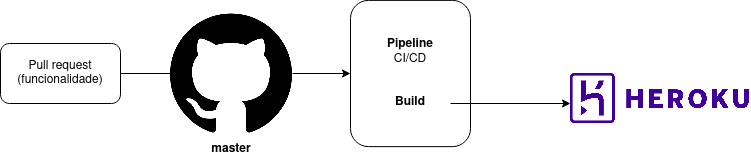

# Documento de Arquitetura de Software

<!--
    Diagrama de Classes, Sequencia, Pacotes, Componentes, Colab, Atividades, Visão de Casos de Uso, Dados, Contexto

    Não fizemos: Context, Casos de Uso
    Fizemos: Componentes, processos, dados
-->

## 1. Introdução

<!-- Finalidade Escopo -->

## 2. Padrão Arquitetural

<!-- MVC, exemplo model view e controller -->
<!-- Extra Middleware Pipeline -->

## 3. Representação Arquitetural

### 3.1 Tecnologias

#### FrontEnd

   O framework <b>React</b> já era conhecido pela maioria dos integrantes da equipe e também possui grande comunidade ativa, o que permite o acesso rápido a conteúdos e treinamentos para aqueles que não possuiam desenvoltura com a tecnologia.

#### BackEnd

<!-- mudar modelo para lista -->

    A tecnologia escolhida pelo grupo para o servidor do projeto foi o <b>Node</b>. Utilizado para executar JavaScript fora do navegador, este framework permite a criação de aplicações web em geral e se mostrou interessante para o grupo pelo mesmo motivo que o React e também para que aqueles que não tinham familiaridade com o desenvolvimento Web necessitassem do contato com apenas uma linguagem.

    O banco de dados do projeto utilizará do <b>Postgres</b>, um sistema de banco de dados Open Source de fácil instalação que possui interfaces simples e intuitivas que facilitam o processo de aprendizado.

#### Outros

    O <b>Docker</b> se mostrou indispensável para o desenvolvimento do nosso projeto, já que a uniformização e contêinerização do ambiente de execução da equipe evita problemas que são mitigados por este empacotamento.

### 3.2 Diagrama de Contexto

O Diagrama de contexto representa de uma forma de mais alto nível a comunicação estabelecida entre as tecnologias, bem como o projeto em um contexto geral.

<iframe frameborder="0" style="width:100%;height:500px;" src="https://viewer.diagrams.net/?tags=%7B%7D&highlight=FFFFFFFF&edit=_blank&layers=1&nav=1&title=Diagrama%20de%20Contexto#Uhttps%3A%2F%2Fdrive.google.com%2Fuc%3Fid%3D13VTp-aDIl5Z-XHXIlwDf3uXGa_WIyTeu%26export%3Ddownload"></iframe>

## 4. Objetivos Arquiteturais e Restrições

## 5. Visão de Casos de Uso

## 6. Visão Lógica

<!-- Classe, Componentes, Pacotes(?) -->

## 7. Visão de Processo

<!-- Estado -->

## 8. Visão de Implantação

Abaixo é possivel observar dois diagramas de implantação, o primeiro explicitando o caso de deploy da e o segundo os nós na execução da aplicação.

<iframe frameborder="0" style="width:100%;height:500px;" src="https://viewer.diagrams.net/?tags={}&highlight=0000ff&edit=_blank&layers=1&nav=1&title=Untitled%20Diagram.drawio#R7VnbctowEP0aHsPYkm3sx3BrZpLMZEpn2j51hC2MG2FRIQj067uyJV8wpNBAQifhQVjHK2m1e1bSyi3cm60%2FCTKf3vOIshayonUL91sI2djz4U8hmxzpBDgHYpFEWqgERslvqkFLo8skoouaoOScyWReB0OepjSUNYwIwZ%2FqYhPO6qPOSUwbwCgkrIl%2BTSI5zVHftUr8hibx1IxsW%2FrNjBhhDSymJOJPFQgPWrgnOJf502zdo0wZz9glbzfc87ZQTNBUHtIgin6Nbu9HP5zB59tBLOln13m80t5ZEbbUE24hj0F%2F3ShZwWOsHuGfzObwwJq16zlLQiITnkI3IypWVBQC9campjsZ1gfYHvOGCv64NC%2FGYlt0u4PMwnJj3AZqSNCLXbMkTgGSXKlAdI3RiWoFHpkr%2BXA5pqqakw%2BYpzQRwCY1K9xf8KVyZXfCUznSQyiZqZwxJa%2F048s0otHd2ACLOQmTNL7LBuq7hYpKL7re60G74AUEFOUzKsUGRHQDw6RNPUSeSl7aHY1NK5zEvgaJjoW46LmkCzxoxhzBnuCU7DkBaR4oOAg8fR7WhOAmYPfRvDmOJwsJxKc9zrjIlMIW%2FIbDQxm0P8qbtKoSx9lFHLOWCcrASav6kriLTXqMB56APgVv7TpvvS068slkQWWDjIWi%2F85PGzcIOliBqXjD8xUfRYLPvxARU6nj%2FOR23xPOHbeNfQxmd5y8bIa3vcNLDmoHHc8OLEeXzpmi3XZ2hPuWHU1ozHi0VFj3J5VyY3ZO3wDFlum8yL65f%2Fca2G4YEO2wHzoNya9Qp%2BbOzquRvLkKP%2BiRLozhCOO272DsBYGXlf5hDMdeu0Jvz0z45AQ36l4QwYMPgl%2Bh5iq%2BY%2B%2FvkjTkKtGgLTXhQ08AjX76cEpfHHheuISY8lHb9VwncFwrKw%2FcNNy2OhcGri7PtWegi9sz0MeeAUawG27pQXZDLpHhtu21A%2BT6nuVbWdl00dtSHF0cxZ9PI98Jxd2GF2gUU5PAcyGnPOYpYYMS7Yo8P9MEL2XuuMoEszDIHKXvqcgSUolaggeOEZtvqn27qH7X3WWV%2FrpW21RrD1QkMG2VY2owulZXWFBNeUpzZJgoO1QCUM1qLz80BKmoCOlzBw3tbWkCfJ%2FgngPJwSx5WQay64B21IVDV90InuiKqscSZeePK6rq2u3vzvX%2Ftlif7YoKeW%2BzDLxe5KL%2FInKbm2SfSDImC2oujd9jeNj%2B%2BeIDquXHhXxXLT%2FR4MEf"></iframe>

## 9. Visão de Implementação

<!-- Classes -->

## 10. Visão de Dados

<!-- Exemplos das models etc, DER, DLD -->

## Versionamentos

|    Data    | Versão |      Descrição       |                                               Autor                                               |
| :--------: | :----: | :------------------: | :-----------------------------------------------------------------------------------------------: |
| 05/10/2021 |  0.1   | Criação do Documento | Arthur Sena, Edvan Gomes, Júlio Schneider, Gabriela Pivetta, Pedro Vítor de Salles Cella, Sara Campos, Victor Samuel, Vinícius Souza |
| 05/10/2021 |  0.2   | Adição das tecnologias usadas | Arthur Sena |
| 05/10/2021 |  0.2.1   | Adição do Diagrama de Contexto | Pedro Vítor de Salles Cella |
| 05/10/2021 | 0.2.2 | Revisão do documento e sugestão de mudança | Sara Campos, Edvan Gomes e Júlio Schneider |
| 05/10/2021 | 0.2.3 | Adição do diagrama de implantação | Sara Campos, Edvan Gomes e Júlio Schneider |
| 05/10/2021 | 0.2.4 | Revisão e adição de diagrama de implantação | Antonio Ruan e Vinícius Souza |