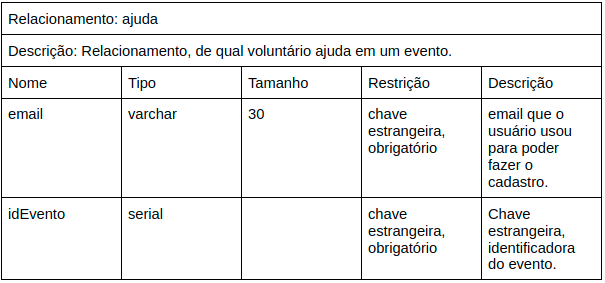
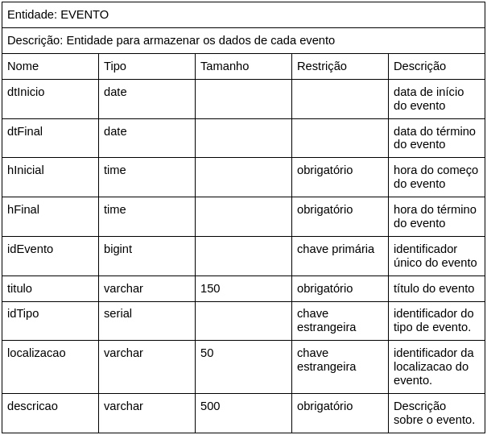

# Documento de Arquitetura de Software

<!--
    Diagrama de Classes, Sequencia, Pacotes, Componentes, Colab, Atividades, Visão de Casos de Uso, Dados, Contexto

    Não fizemos: Context, Casos de Uso
    Fizemos: Componentes, processos, dados
-->

## 1. Introdução

<!-- Finalidade Escopo -->

## 2. Padrão Arquitetural

<!-- MVC, exemplo model view e controller -->
<!-- Extra Middleware Pipeline -->

## 3. Representação Arquitetural

### 3.1 Tecnologias

#### FrontEnd

   O framework <b>React</b> já era conhecido pela maioria dos integrantes da equipe e também possui grande comunidade ativa, o que permite o acesso rápido a conteúdos e treinamentos para aqueles que não possuiam desenvoltura com a tecnologia.

#### BackEnd

<!-- mudar modelo para lista -->

    A tecnologia escolhida pelo grupo para o servidor do projeto foi o <b>Node</b>. Utilizado para executar JavaScript fora do navegador, este framework permite a criação de aplicações web em geral e se mostrou interessante para o grupo pelo mesmo motivo que o React e também para que aqueles que não tinham familiaridade com o desenvolvimento Web necessitassem do contato com apenas uma linguagem.

    O banco de dados do projeto utilizará do <b>Postgres</b>, um sistema de banco de dados Open Source de fácil instalação que possui interfaces simples e intuitivas que facilitam o processo de aprendizado.

#### Outros

    O <b>Docker</b> se mostrou indispensável para o desenvolvimento do nosso projeto, já que a uniformização e contêinerização do ambiente de execução da equipe evita problemas que são mitigados por este empacotamento.

### 3.2 Diagrama de Contexto

O Diagrama de contexto representa de uma forma de mais alto nível a comunicação estabelecida entre as tecnologias, bem como o projeto em um contexto geral.

<iframe frameborder="0" style="width:100%;height:500px;" src="https://viewer.diagrams.net/?tags=%7B%7D&highlight=FFFFFFFF&edit=_blank&layers=1&nav=1&title=Diagrama%20de%20Contexto#Uhttps%3A%2F%2Fdrive.google.com%2Fuc%3Fid%3D13VTp-aDIl5Z-XHXIlwDf3uXGa_WIyTeu%26export%3Ddownload"></iframe>

## 4. Objetivos Arquiteturais e Restrições

| Objetivos | |
| :--- | --- |
| Deploy | O deploy da aplicação deve ser automatizado |
| Escalabilidade | A aplicação deve ser escalável |
| Segurança | A aplicação deve tratar de forma de segura os dados sensíveis dos usuários |
| Usabilidade | A aplicação deve ser intuitiva e interativa |

| Restrições | |
| :--- | --- |
| Conectividade | É necessário ter conexão com internet para acessar a aplicação |
| Linguagem | A linguagem padrão da aplicação é a Língua Portuguesa do Brasil |
| Plataforma | É necessário o uso de um navegador tanto em dispositivos desktop, quanto mobile |
| Público | Brasileiros que se interessam ou possuem necessidade envolvendo animais domésticos |
| Prazo | A aplicação há de ser finalizada até o fim da disciplina |
| Infraestrutura | Criar um sistema otimizado que não necessite de uma infraestrutura robusta para sustentar a aplicação |

## 5. Visão de Casos de Uso

## 6. Visão Lógica

<!-- Classe, Componentes, Pacotes(?) -->

## 7. Visão de Processo

<!-- Estado -->

## 8. Visão de Implantação

<!-- Devops -->

## 9. Visão de Implementação

<!-- Classes -->

## 10. Visão de Dados

Este tópico descreve o modelo de persistência de dados utilizado no sistema, representado através dos modelos persistidos no banco de dados Postgres.

Tendo uma representação do seu [modelo lógico](../modelagemDB/modelagem_db.md#Diagrama%20Lógico) e o seu [modelo de entidade e relacionamentos](../modelagemDB/modelagem_db.md#Diagrama%20Entidade%20Relacionamento%20(DER)).

### Modelo Ajuda

- Formato dos dados
  

- Exemplo

### Modelo Cria

- Formato dos dados

- Exemplo

### Modelo Evento

- Formato dos dados

- Exemplo

### Modelo Local

- Formato dos dados

- Exemplo

### Modelo Participa

- Formato dos dados

- Exemplo

### Modelo Pet

- Formato dos dados

- Exemplo

### Modelo Tipo

- Formato dos dados

- Exemplo

### Modelo Usuario

- Formato dos dados

- Exemplo

### Modelo Voluntário

- Formato dos dados

- Exemplo

## Versionamentos

|    Data    | Versão |      Descrição       |                                               Autor                                               |
| :--------: | :----: | :------------------: | :-----------------------------------------------------------------------------------------------: |
| 05/10/2021 |  0.1   | Criação do Documento | Arthur Sena, Edvan Gomes, Júlio Schneider, Gabriela Pivetta, Pedro Vítor de Salles Cella, Sara Campos, Victor Samuel, Vinícius Souza |
| 05/10/2021 |  0.2   | Adição das tecnologias usadas | Arthur Sena |
| 05/10/2021 |  0.2.1   | Adição do Diagrama de Contexto | Pedro Vítor de Salles Cella |
| 05/10/2021 | 0.2.2 | Revisão do documento e sugestão de mudança | Sara Campos, Edvan Gomes e Júlio Schneider |
| 06/10/2021 | 0.3 | Adição dos Objetivos Arquiteturais e Restrições | Gabriela Pivetta, Paulo Gonçalves, Thiago Luiz |
| 07/10/2021 | 0.3.1 | Adição da Visão de Dados | Gabriela Pivetta, Paulo Gonçalves, Thiago Luiz |
