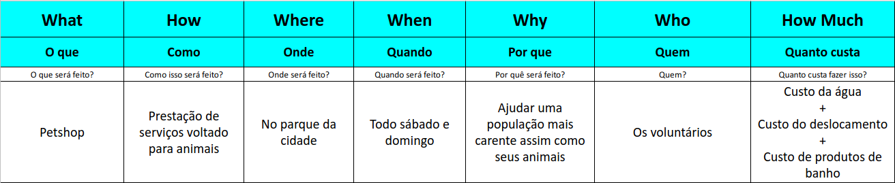
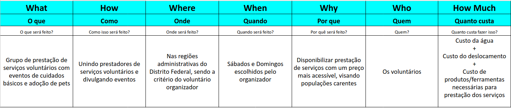
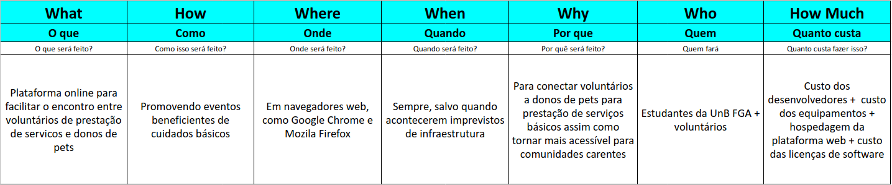

# 5W2H

Esse método vem com o intuito de descrever melhor o tema do projeto. Tentando solidificar essa ideia ao máximo a ponto de ficar claro para todos os integrantes do grupo sobre o que se trata esse tema. Isso é feito respondendo a 7 perguntas, sendo elas <b>What(O que), Where,(Onde), When(Quando), Why(Por que), Who(Quem), How(Como) e How much(Quanto)</b>

Abaixo temos o 5W2H realizado pelo grupo, sendo abordado uma visão não computacional e computacional

### Não Computacional - Versão 1

### Não Computacional - Versão 2

### Computacional - Versão 1

## Versionamentos

|Data|Versão|Descrição|Autor|
|:--------:|:---:|:-------------------: |:-----------------------:|
|03/08/2021| 0.1 | Criação do documento | Pedro Vítor de Salles Cella |
|05/08/2021| 0.2 | Atualização do documento | Pedro Vítor de Salles Cella |  