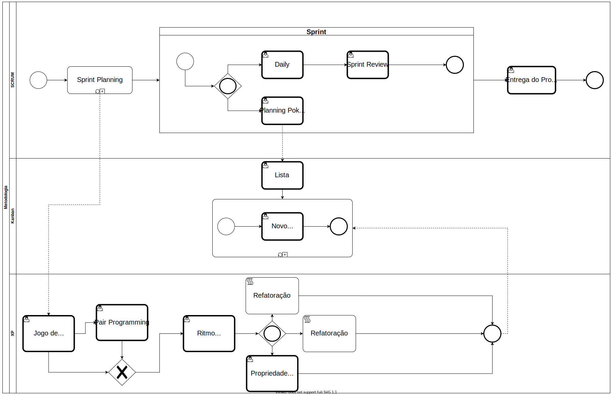

# BPMN

O BPMN é uma notação muito conhecida no mercado com o foco na especificação de processos de desenvolvimento, ela possui uma grande riqueza na representação de detalhes advindos do desenvolvimento de software.

Abaixo estão representados os BPMNs que representam a metodologia híbrida utilizada pelo grupo, sendo usadas o SCRUM, o Kanban e o XP.

## BPMN - Versão 2

## BPMN - Versão 1

## Versionamentos

|Data|Versão|Descrição|Autor|
|:--------:|:---:|:-------------------: |:-----------------------:|
|05/08/2021| 0.1 | Criação do documento | Julio Schneider, Edvan Gomes, Pedro Vítor de Salles Cella |
|05/08/2021| 0.2 | Adicionando o artefato | Paulo Gonçalves Lima |
|05/08/2021| 0.3 | Adicionando a segunda versão do BPMN | Paulo Gonçalves Lima e Pedro Vítor de Salles Cella |
