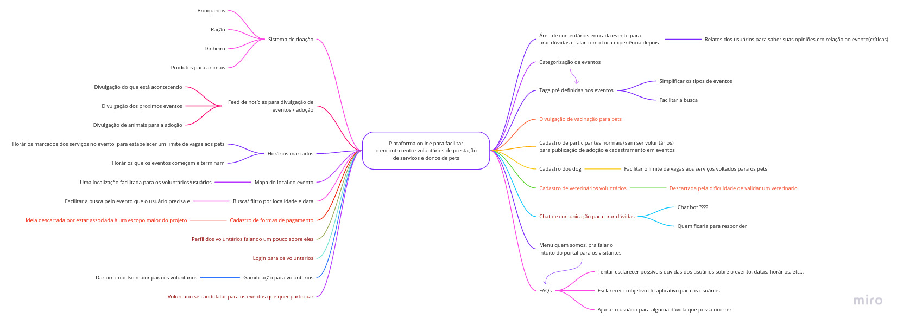

# <i>Brainstorm</i>

|Ideia|Responsável|Votos|
|:--------:|:---:|:---:|
| Sistema de Doação| Pedro Cella | 7 |
| Feed de notícias para divulgação de eventos/ animais disponíveis para adoção/doações/ outros | Arthur Sena | 7 |
| Horários marcados | Paulo Gonçalves | 5 |
| Busca/filtro por localidade e data | Gabriela Pivetta | 5 |
| Mapa do local do evento(Google maps) | Pedro Cella | 5 |
| Doação de Ração | Antonio Ruan | 4 |
| Cadastro de formas de pagamento | Pedro Cella | 4 |
| Área de comentários em cada evento para tirar dúvidas e falar como foi a experiência depois | Gabriela Pivetta | 4 |
| Categorização de eventos | Vinicius Souza | 4 |
| Tags pré-definidas nos eventos para facilitar a busca(o que vai oferecer) | Gabriela Pivetta | 4 |
| Divulgação de vacinação para pets | Antonio Ruan | 3 |
| Cadastro dos dog | Gabriela Pivetta | 3 |
| Menu quem somos, para falar o intuito do portal para os visitantes | Victor Samuel | 3 |
| Cadastro de veterinários voluntários | Júlio César | 2 |
| Login para os voluntários | Paulo Gonçalves | 2 |
| Chat de comunicação | Victor Samuel | 2 |
| Gamificação para ajudantes | Antonio Ruan | 2 |
| Perfil dos voluntários falando um pouco sobre eles | Gabriela Pivetta | 2 |
| Cadastro de participantes normais(sem ser voluntários) para publicação de adoção e cadastramento em eventos | Victor Samuel | 1 |
| Voluntário para se candidatar para os eventos que quer participar | Gabrielra Pivetta | 1 |
| FAQ para o evento | Júlio César | 1 |
| Inscrição em eventos de acordo com o tipo de usuário | Victo Samuel | 0 |
| Home com os eventos mais próximo por localidade e data | Gabriela Pivetta | 0 |
| Doação de remédios | Antonio Ruan | 0 |
| Recomendação de locais | Pedro Cella | 0 |
| Cadastro humano/pet para ser beneficiado por um evento | Júlio César | 0 |
| Mia Ajuda(ver como é para usar como base) | Paulo Gonçalves | 0 |
| Rankeamento de voluntários | Antonio Ruan | 0 |

### Mapa Mental

<b>Legenda:</b>

1. <b>Vermelho:</b> Ideias descartadas ou fora do escopo definido 
2. <b>Vinho:</b> Ideias que ainda não definidas

## Versionamentos

|Data|Versão|Descrição|Autor|
|:--------:|:---:|:-------------------: |:-----------------------:|
|03/08/2021| 0.1 | Criação do documento | Pedro Vítor de Salles Cella |
|05/08/2021| 0.2 | Atualização do documento | Pedro Vítor de Salles Cella |  