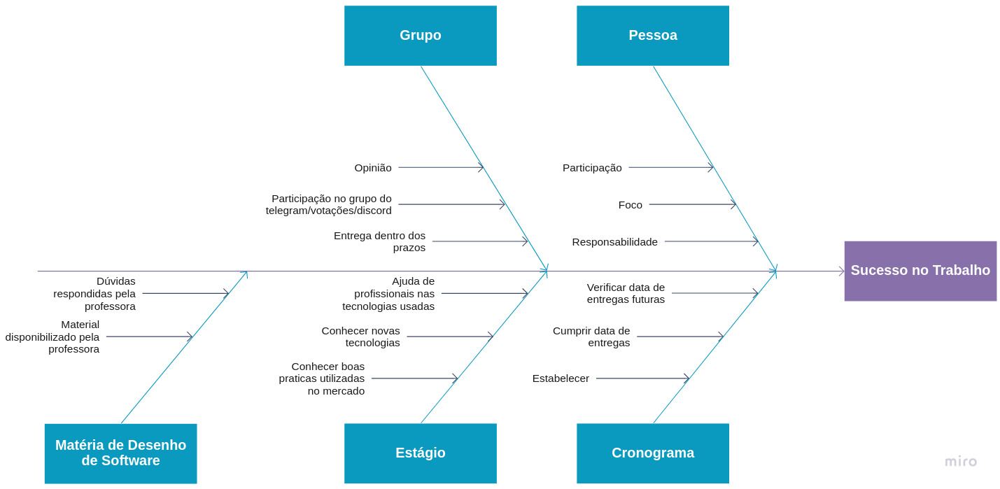
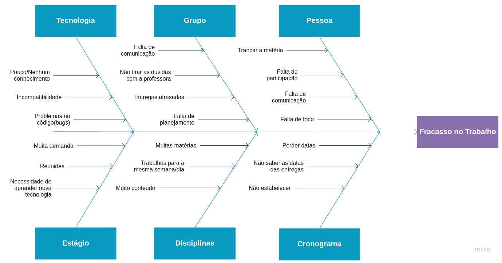

# Causa-Efeito (Diagrama de Ishikawa)

O Diagrama de Causa-Efeito, também conhecido como Diagrama de Ishikawa ou Espinha de Peixe é um método que consiste em entender possíveis eventos e as causa que influenciam seu acontecimento, tratamos como eventos e não como problemas pois o evento pode ser tanto algo negativo, quanto algo positivo, então seu uso não necessariamente se limita a algum problema em que o projeto possa vir a ter.

O grupo resolveu utilizar de dois eventos, são eles o <b>sucesso no trabalho</b> e o <b>fracasso no trabalho</b>, dessa forma ficaria claro as causas que acarretariam ambos e de que forma aliada a nossa metodologia o grupo poderia fazer para evitar ou seguir essas possíveis situações.

### Sucesso no Trabalho

### Fracasso no Trabalho

## Versionamentos

|Data|Versão|Descrição|Autor|
|:--------:|:---:|:-------------------: |:-----------------------:|
|03/08/2021| 0.1 | Criação do documento | Pedro Vítor de Salles Cella |
|05/08/2021| 0.2 | Atualização do documento | Pedro Vítor de Salles Cella |  