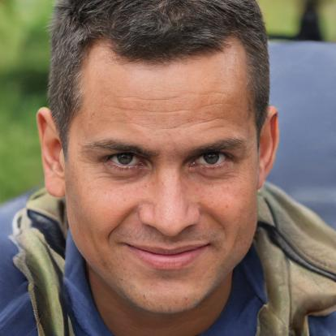
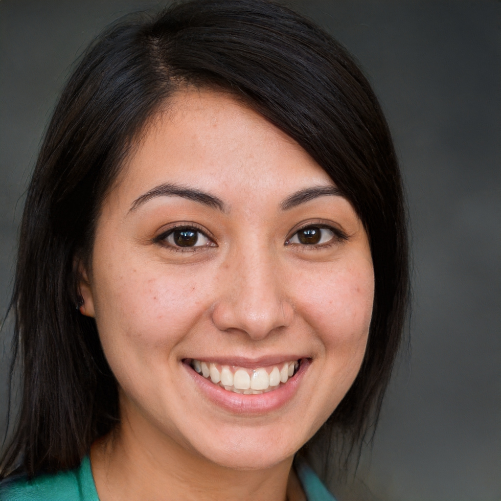
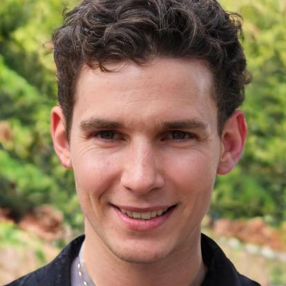
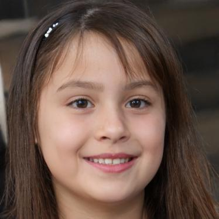

# Personas

## Primeira Persona (Primária) - Usuário

|              | Persona                                                                                         |
| ------------ | ----------------------------------------------------------------------------------------------- |
| Foto         |                            |
| Nome         | João Pedro                                                                                      |
| Idade        | 37 anos                                                                                         |
| Profissão    | Autônomo                                                                                        |
| Hábito       | Constantemente esquece de dar banho em seus cachorros                                           |
| Objetivo     | Facilitar o cuidado dos seus pets                                                               |
| Expectativas | Ter acesso a eventos relacionados ao cuidado de pets e contribuir com eles                      |

## Segunda Persona (Primária) - Usuário

|              | Persona                                                                       |
| ------------ | ----------------------------------------------------------------------------- |
| Foto         |  |
| Nome         | Camila                                                                        |
| Idade        | 16 anos                                                                       |
| Profissão    | Estudante                                                                     |
| Hábito       | Passear com seu cachorro e ajudar animais de rua                              |
| Objetivo     | Encontrar eventos de adoção de animais para adotar mais um cachorro           |
| Expectativas | Conseguir participar de um evento de adoção e adotar um cachorro              |

## Terceira Persona (Primária) - Voluntário

|              | Persona                                                                       |
| ------------ | ----------------------------------------------------------------------------- |
| Foto         |  |
| Nome         | Lucas Henrique                                                                |
| Idade        | 23 anos                                                                       |
| Profissão    | Estudante de Engenharia                                                       |
| Hábito       | Participar de causas beneficentes                                             |
| Objetivo     | Contribuir em eventos focados na causa animal                                 |
| Expectativas | Encontrar e criar eventos de cuidados pet                                     |

## Anti-Persona

|              | Persona                                                                           |
| ------------ | --------------------------------------------------------------------------------- |
| Foto         |  |
| Nome         | Ana Clara                                                                         |
| Idade        | 8 anos                                                                            |
| Profissão    | Estudante                                                                         |
| Hábito       | Brincar com sua calopsita                                                         |
| Objetivo     | Se tornar médica veterinária                                                      |
| Expectativas | Espera encontrar informações sobre como cuidar de pássaros                        |

## Referências

Imagens das personas retiradas do site: thispersondoesnotexist.com 

## Histórico de Versões

| Data       | Versão | Descrição   | Autores          |
| ---------- | ------ | ----------- | ---------------- |
| 23/08/2021 | 0.1    | Criação do documento e das personas    | Gabriela Pivetta, Paulo Cella, Vinicius Souza, Victor Samuel, Antonio Ruan, Arthur Sena, Paulo Gonçalves |
