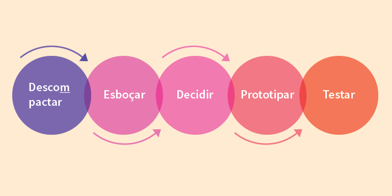

# Sobre o Design Sprint

## Definição

O <i>Design Sprint</i> é um método, ou uma forma de se pensar usada para resolver problemas complexos a partir de uma cooperação ,nele ocorrem a concretização de uma ideia assim como suas implementações e funcionalidades, tudo isso em um curto período de tempo

## Etapas

## Versionamentos

|Data|Versão|Descrição|Autor|
|:--------:|:---:|:-------------------: |:-----------------------:|
|03/08/2021| 0.1 | Criação do documento | Pedro Vítor de Salles Cella | 