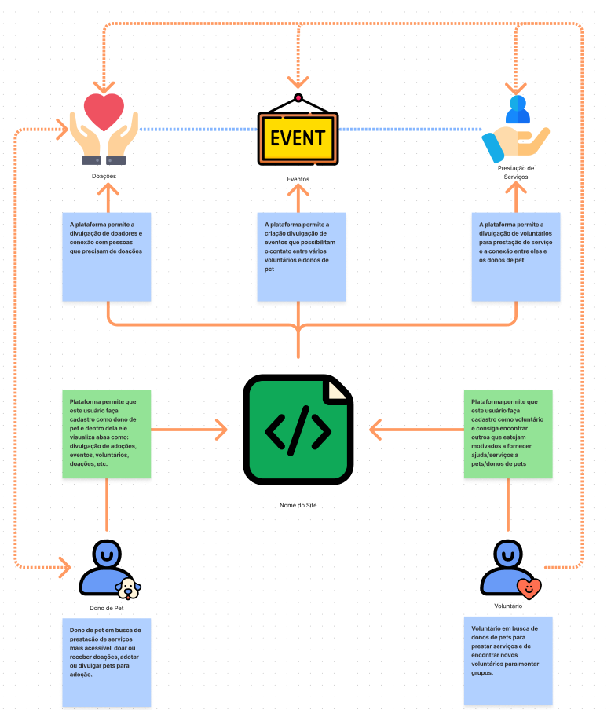
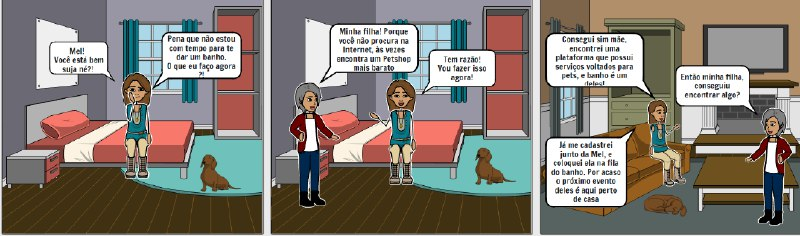

# Fase 3 - <i>Decision</i>

Realizado a criação dos RichPictures é realizado a decisão de qual representa melhor a visão do projeto, essa fase consiste nessa decisão bem como a geração de possivéis novos artefatos como o <i>storyboard</i> que pode definir o caminho do projeto

## RichPicture Escolhido - Arthur Sena, Júlio César e Sara Campos

## StoryBoard

O <i>storyboard</i> serve para ilustrar de uma maneira mais fácil e não tão técnica situações do mundo real em que a aplicaçãopossa vir a fazer parte como uma forma de solução

### Storyboard 1

## Versionamentos

|Data|Versão|Descrição|Autor|
|:--------:|:---:|:-------------------: |:-----------------------:|
|03/08/2021| 0.1 | Criação do documento | Pedro Vítor de Salles Cella |
|03/08/2021| 0.2 | Adição do Storyboard 1 | Paulo Gonçalves Pedro Vítor de Salles Cella | 

## Referências