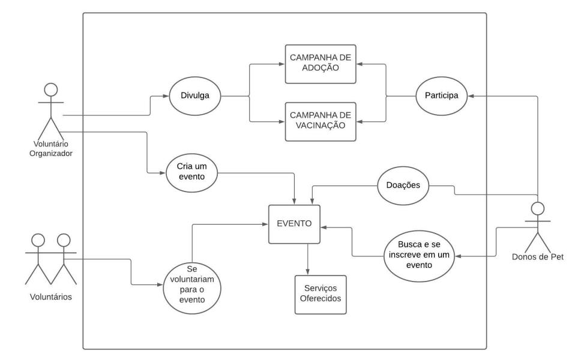
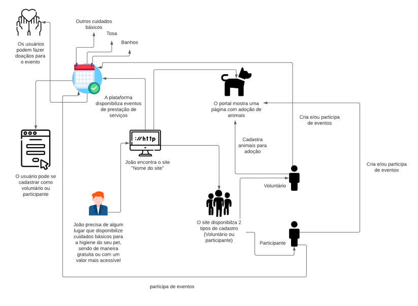
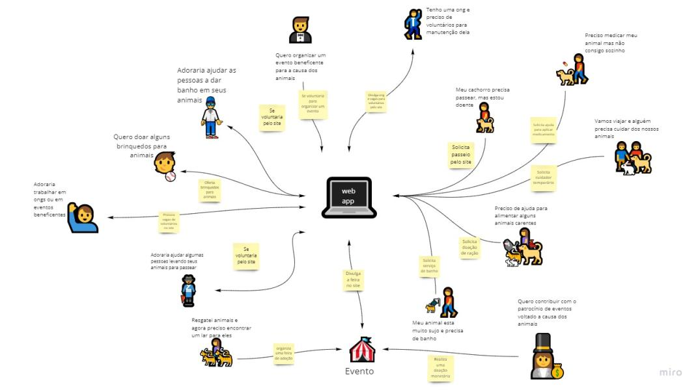
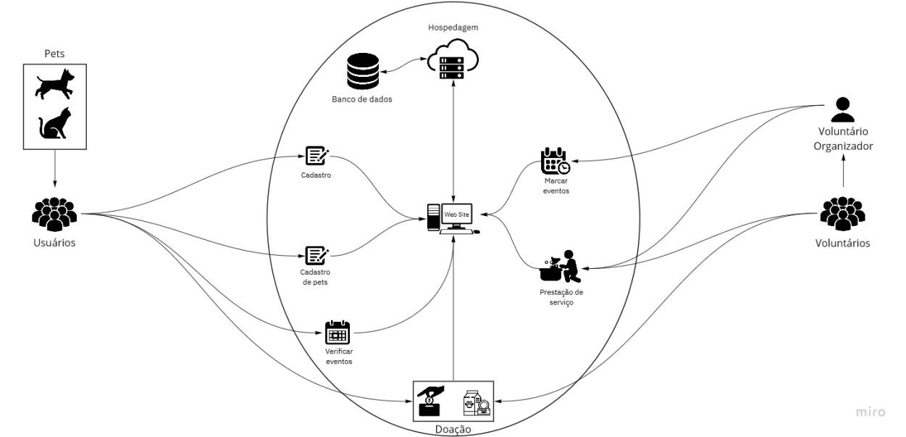

# Fase 2 - <i>Sketch</i>

Essa fase consiste na realização de um RichPictur feito por cada integrante para ter a visão de cada um e ser feita a votação na próxima etapa

Pelo grupo ter muito mais membros, foi feito uma divisão em pequenos grupos, sendo ela 3 grupos de três pessoas e um grupo de 2 pessoas. Abaixo temos os Richpictures realizados pelos grupos

## RichPicture 1 - Gabriela Pivetta, Thiago Luiz e Victor Samuel

## RichPicture 2 - Gabriela Pivetta, Thiago Luiz e Victor Samuel

## RichPicture - Arthur Sena, Júlio César e Sara Campos

<iframe style="border: 1px solid rgba(0, 0, 0, 0.1);" width="800" height="450" src="https://www.figma.com/embed?embed_host=share&url=https%3A%2F%2Fwww.figma.com%2Ffile%2FViqHT2jZSLtXBDsJ7DFVVw%2FRichpicture%3Fnode-id%3D0%253A1" allowfullscreen></iframe>

## RichPicture - Antonio Ruan, Edvan Junior e Vinicius Souza

## RichPicture - Paulo Gonçalves e Pedro Cella

## Versionamentos

|Data|Versão|Descrição|Autor|
|:--------:|:---:|:-------------------: |:-----------------------:|
|03/08/2021| 0.1 | Criação do documento | Pedro Vítor de Salles Cella | 

## Referências