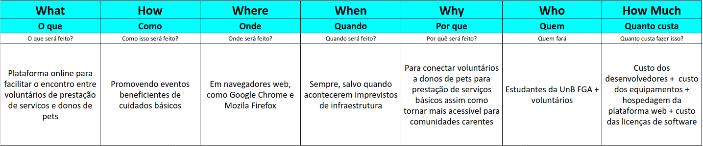
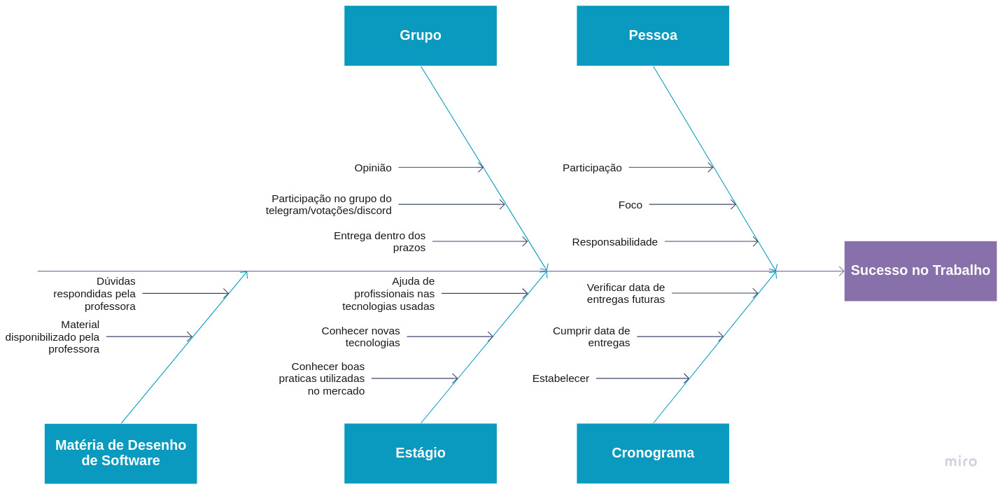
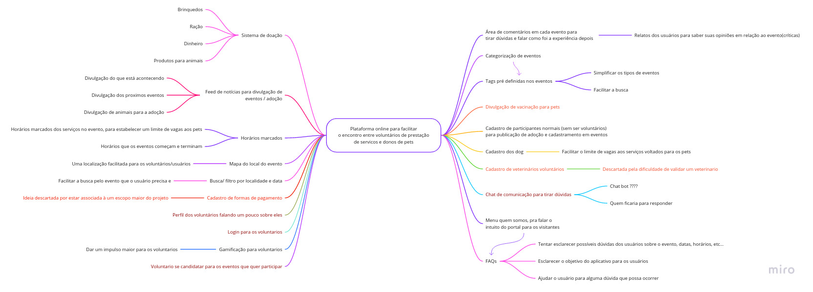

# Fase 1 - <i>Unpack</i>

## Definição

Como mencionado na descrição do <i>Design Sprint</i> a fase de entendimento(<i>unpack</i>) se baseia na compreensão do que será feito para solucionar o problema, dessa forma são utilizadas vários métodos para se entender o escopo daquele projeto.

## 5W2H

Esse método vem com o intuito de descrever melhor o tema do projeto. Tentando solidificar essa ideia ao máximo a ponto de ficar claro para todos os integrantes do grupo sobre o que se trata esse tema. Isso é feito respondendo a 7 perguntas, sendo elas <b>What(O que), Where,(Onde), When(Quando), Why(Por que), Who(Quem), How(Como) e How much(Quanto)</b>

Abaixo temos o 5W2H realizado pelo grupo, sendo abordado uma visão não computacional e computacional

### Não Computacional - Versão 1

### Não Computacional - Versão 2

### Computacional - Versão 1

## Causa-Efeito (Diagrama de Ishikawa)

O Diagrama de Causa-Efeito, também conhecido como Diagrama de Ishikawa ou Espinha de Peixe é um método que consiste em entender possíveis eventos e as causa que influenciam seu acontecimento, tratamos como eventos e não como problemas pois o evento pode ser tanto algo negativo, quanto algo positivo, então seu uso não necessariamente se limita a algum problema em que o projeto possa vir a ter.

O grupo resolveu utilizar de dois eventos, são eles o <b>sucesso no trabalho</b> e o <b>fracasso no trabalho</b>, dessa forma ficaria claro as causas que acarretariam ambos e de que forma aliada a nossa metodologia o grupo poderia fazer para evitar ou seguir essas possíveis situações.

### Sucesso no Trabalho

### Fracasso no Trabalho

## <i>Brainstorm</i>

Assim como nome sugere esse método é realizado em grupo onde cada um tenta dar o máximo de ideas possível, sempre tentando focar no tema, mas não tendo nenhuma limitação quanto ao tipo de ideia, dessa forma os integrantes podem trazer diversos possibilidades de soluções ao mesmo em que eles possuem uma liberdade criativa que facilita esse processo. Geralmente após o <i>Brainstorm</i> usa-se um Mapa Mental para documentar todas as ideias levantadas.

Abaixo, temos a lista de ideias sugeridas pelos membros organizado pelo número de votos realizado na votação feita pelo grupo e por fim um mapa mental documentando todas as ideias levantadas.

### <i>Brainstorm</i>

|Ideia|Responsável|Votos|
|:--------:|:---:|:---:|
| Sistema de Doação| Pedro Cella | 7 |
| Feed de notícias para divulgação de eventos/ animais disponíveis para adoção/doações/ outros | Arthur Sena | 7 |
| Horários marcados | Paulo Gonçalves | 5 |
| Busca/filtro por localidade e data | Gabriela Pivetta | 5 |
| Mapa do local do evento(Google maps) | Pedro Cella | 5 |
| Doação de Ração | Antonio Ruan | 4 |
| Cadastro de formas de pagamento | Pedro Cella | 4 |
| Área de comentários em cada evento para tirar dúvidas e falar como foi a experiência depois | Gabriela Pivetta | 4 |
| Categorização de eventos | Vinicius Souza | 4 |
| Tags pré-definidas nos eventos para facilitar a busca(o que vai oferecer) | Gabriela Pivetta | 4 |
| Divulgação de vacinação para pets | Antonio Ruan | 3 |
| Cadastro dos dog | Gabriela Pivetta | 3 |
| Menu quem somos, para falar o intuito do portal para os visitantes | Victor Samuel | 3 |
| Cadastro de veterinários voluntários | Júlio César | 2 |
| Login para os voluntários | Paulo Gonçalves | 2 |
| Chat de comunicação | Victor Samuel | 2 |
| Gamificação para ajudantes | Antonio Ruan | 2 |
| Perfil dos voluntários falando um pouco sobre eles | Gabriela Pivetta | 2 |
| Cadastro de participantes normais(sem ser voluntários) para publicação de adoção e cadastramento em eventos | Victor Samuel | 1 |
| Voluntário para se candidatar para os eventos que quer participar | Gabrielra Pivetta | 1 |
| FAQ para o evento | Júlio César | 1 |
| Inscrição em eventos de acordo com o tipo de usuário | Victo Samuel | 0 |
| Home com os eventos mais próximo por localidade e data | Gabriela Pivetta | 0 |
| Doação de remédios | Antonio Ruan | 0 |
| Recomendação de locais | Pedro Cella | 0 |
| Cadastro humano/pet para ser beneficiado por um evento | Júlio César | 0 |
| Mia Ajuda(ver como é para usar como base) | Paulo Gonçalves | 0 |
| Rankeamento de voluntários | Antonio Ruan | 0 |

### Mapa Mental

<b>Legenda:</b>

1. <b>Vermelho:</b> Ideias descartadas ou fora do escopo definido 
2. <b>Vinho:</b> Ideias que ainda não definidas

## Versionamentos

|Data|Versão|Descrição|Autor|
|:--------:|:---:|:-------------------: |:-----------------------:|
|03/08/2021| 0.1 | Criação do documento | Pedro Vítor de Salles Cella | 

## Referências