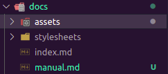
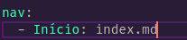
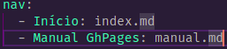

## Como adicionar uma página

 * Crie um arquivo markdown na pasta `docs`

 

 * Adicione o arquivo criado no campo `nav` do arquivo `mkdocs.yml`

 
 

 

## Como testar o github pages localmente

### Requisitos

[Docker](https://www.docker.com/)

### Intruções

Na primeira utilização, é necessário fazer o build do container, para isso, utilize o comando.
```
make build
```
Após isso basta iniciar o container com o comando.
```
make run
```
Se tudo der certo, será mostrado no seu terminal a porta para acessar localmente