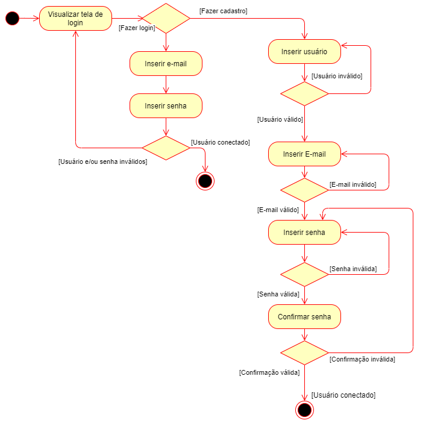
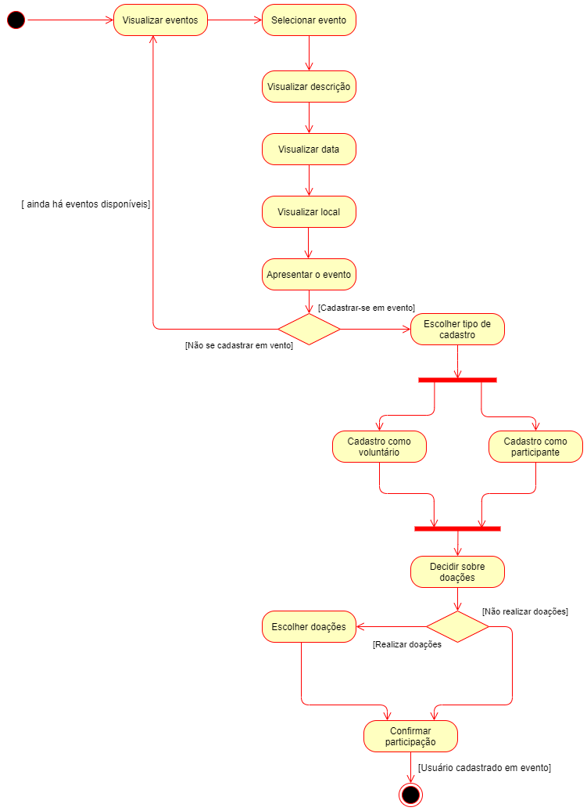
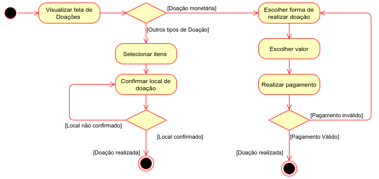
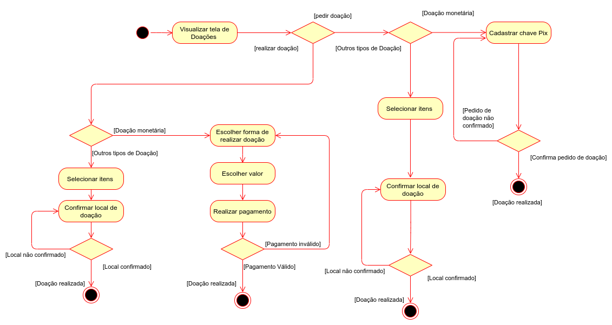
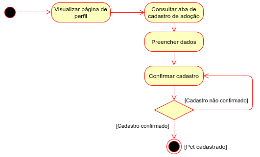
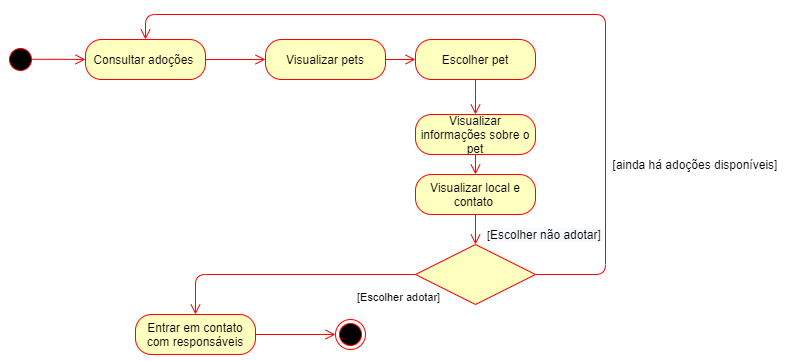

# Diagrama de Ativivades

## Definição

Um diagrama de atividade é essencialmente um fluxograma que mostra as atividades executadas por um sistema. Diagramas de atividade, junto com diagramas de caso de uso e de máquina de estados, são considerados diagramas de comportamento porque descrevem o que é necessário acontecer no sistema sendo modelado. 

## Ferramenta
Para confecção, foi usado o <a href="https://draw.io/">Draw.io</a>, que é um editor gráfico online no qual é possível desenvolver desenhos, gráficos e outros sem a necessidade de usar um software caro e pesado. Ele disponibiliza recursos para criação de qualquer tipo de desenho porém, possui uma parte dedicada à arquitetura da informação.

## Processos implementados 
* Logar e cadastrar
* Cadastro de Pets
* Cadastro como voluntário
* Criar e publicar evento
* Visualizar e inscrever-se em eventos
* Realizar doações 
* Cadastrar pet para adoção
* Visualizar adoções

## Versões 
### Versão 0.1
Para esta primeira versão do Diagrama de Atividades foram escolhidos diagramas voltados a principal regra de negócio da aplicação, que relembrando, baseia-se em ser um mecanismo de união entre prestadores de atividades voluntárias e donos de animais domésticos de pequeno porte, por meio de eventos beneficentes. 

### Versão 0.2
Para esta segunda versão do Diagrama de Atividades, os diagramas foram atualizados devido a mudanças de padrões de projeto implementadas.

## Diagramas

### Processo de logar e cadastrar

#### v0.1

### Processo de cadastro de pets

#### v0.1

### Processo de cadastro como voluntário

#### v0.1

### Processo de criar e publicar evento

#### v0.1

### Processo de visualizar e inscrever-se em eventos 

#### v0.1

### Processo de realizar doações

#### v0.1

#### v0.2
Nessa atualização foi implementada a ramificação para o fluxo de pedir ou realizar doação.

### Processo de cadastrar pet para adoção

#### v0.1

### Processo de visualizar adoções

#### v0.1

## Referências

> Vídeo Aula Diagrama de Atividades, Milene Serrano <a target="_blank" href="https://unbbr-my.sharepoint.com/personal/mileneserrano_unb_br/_layouts/15/onedrive.aspx?id=%2Fpersonal%2Fmileneserrano%5Funb%5Fbr%2FDocuments%2FArqDSW%20%2D%20V%C3%ADdeosOriginais%2F06c%20%2D%20VideoAula%20%2D%20DSW%2DModelagem%20%2D%20Atividades%2Emp4&parent=%2Fpersonal%2Fmileneserrano%5Funb%5Fbr%2FDocuments%2FArqDSW%20%2D%20V%C3%ADdeosOriginais&originalPath=aHR0cHM6Ly91bmJici1teS5zaGFyZXBvaW50LmNvbS86djovZy9wZXJzb25hbC9taWxlbmVzZXJyYW5vX3VuYl9ici9FZDlrLU92TUg3aE1sTk1qNkNHVmVuTUJTeWVWckRCT2RnODRDenhfYUhJOWd3P3J0aW1lPUlkNndsMkZqMlVn">Disponível Aqui</a>

> Tudo sobre Diagramas de Atividades, Lucid Chart <a target="_blank" href="https://www.lucidchart.com/pages/pt/o-que-e-diagrama-de-atividades-uml">Disponível Aqui</a>

## Versionamentos

|Data|Versão|Descrição|Autor|
|:--------:|:---:|:-------------------: |:-----------:|
|19/08/2021| 0.1 | Criação do documento e inserções iniciais | Victor Samuel | 
|20/08/2021| 0.2 | Inserção do Diagrama de processo de doações | Victor Samuel | 
|20/08/2021| 0.3 | Inserção do Diagrama de processo de cadastro de usuário | Victor Samuel | 
|20/08/2021| 0.4 | Inserção do Diagrama de processo de cadastro de pets | Victor Samuel | 
|20/08/2021| 0.5 | Inserção do Diagrama de processo de criação de evento | Victor Samuel | 
|20/08/2021| 0.6 | Inserção do Diagrama de processo de cadastramento de pets para adoção | Victor Samuel | 
|14/09/2021| 0.7 | Atualizando versão do diagrama de doação e adicionando rastrebilidade entre documentos | Victor Samuel, Vinicius Vieira e Antonio Ruan | 