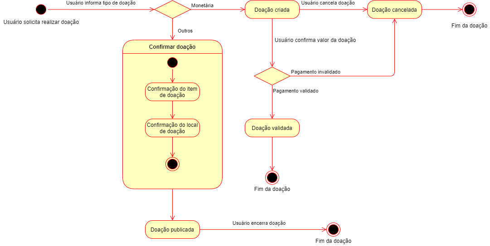
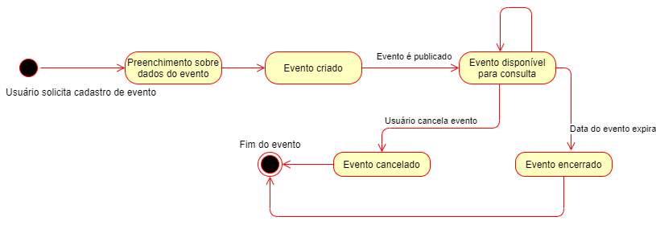
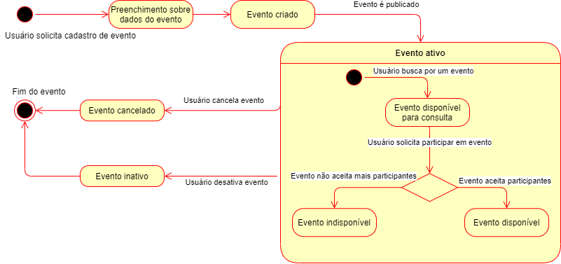
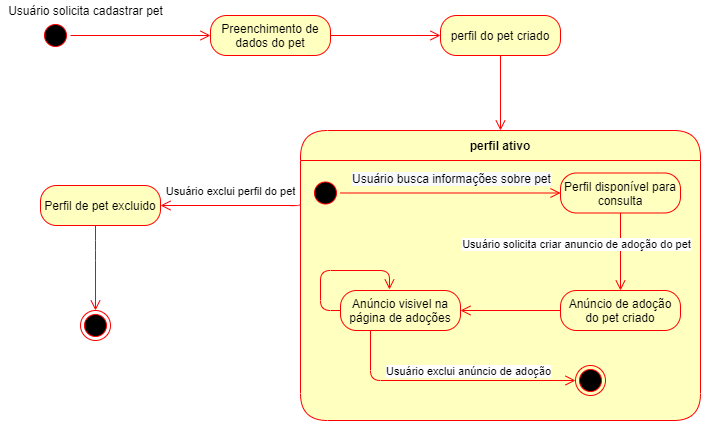
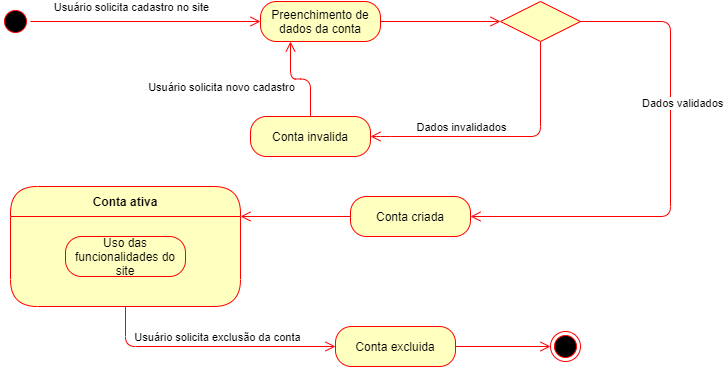

# Diagrama de Estados

## Definição

Dado que estados indicam as várias combinações de informações que um objeto pode conter. Um diagrama de estados busca representar todos esses possíveis estados, e suas transições. Estados são geralmente representados com retângulos com cantos arredondados e rotulados com o nome de estado. As transições são marcadas com setas que fluem de um estado para outro, mostrando como ocorrem essas mudanças. No desenvolvimento deste diagrama foi utlizada a ferramenta <a target="_blank" href="https://draw.io/">Draw.io</a>.

### Diagrama de Estado - Doação (v0.1)

### Diagrama de Estado - Evento (v0.1)

### Diagrama de Estado - Evento (v0.2)

### Diagrama de Estado - Pet (v0.1)

### Diagrama de Estado - Conta de Usuário (v0.1)

## Referências

> Vídeo Aula Diagrama de Estados, Milene Serrano <a target="_blank" href="https://unbbr-my.sharepoint.com/:v:/r/personal/mileneserrano_unb_br/Documents/ArqDSW%20-%20V%C3%ADdeosOriginais/06d%20-%20VideoAula%20-%20DSW-Modelagem%20-%20Estados.mp4?csf=1&web=1&e=h813iu">Disponível Aqui</a>

> "O que é um diagrama de máquina de estados?", Lucid Chart <a target="_blank" href="https://www.lucidchart.com/pages/pt/o-que-e-diagrama-de-maquina-de-estados-uml">Disponível Aqui</a>

## Versionamentos

|Data|Versão|Descrição|Autor|
|:--------:|:---:|:-------------------: |:-----------:|
|20/08/2021| 0.1 | Criação do documento | Vinícius Souza |
|21/08/2021| 0.2 | Adição de diagramas de estado para Conta e Pet | Vinícius Souza |
|22/08/2021| 0.3 | Atualização do Documento | Arthur Sena, Paulo Gonçalves, Pedro Cella, Victor Santos, Vinicius Souza |    