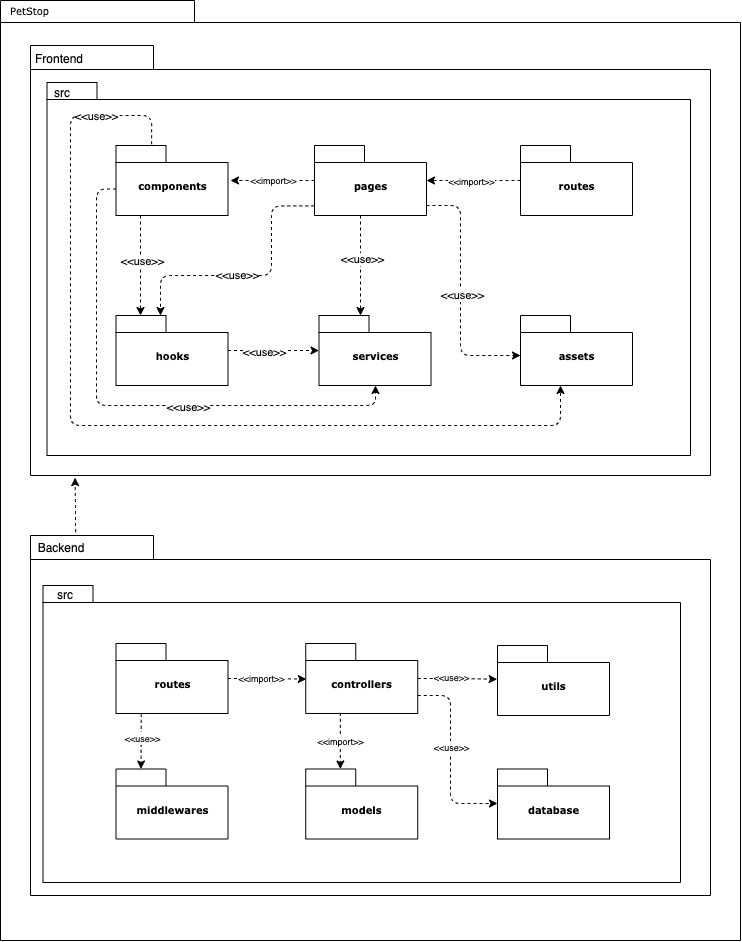

# Diagrama de Pacotes

## Definição

Diagramas de pacotes são diagramas estruturais usados para mostrar, em uma forma de pacotes, a organização e disposição de vários elementos de modelos. No desenvolvimento deste diagrama foi utlizada a ferramenta <a target="_blank" href="https://draw.io/">Draw.io</a>.

## Versão 1.0 

<iframe frameborder="0" style="width:100%;height:650px;" src="https://viewer.diagrams.net/?tags=%7B%7D&highlight=0000ff&edit=_blank&layers=1&nav=1&title=Diagrama%20de%20Pacotes%20-%20Detalhado#Uhttps%3A%2F%2Fdrive.google.com%2Fuc%3Fid%3D1_hAiu-3ojxPBdjDLXdze3OCvxcyUdxgN%26export%3Ddownload"></iframe>

## Versão 0.1

## Referências

> Vídeo Aula Diagrama de Pacotes, Milene Serrano <a target="_blank" href="https://unbbr-my.sharepoint.com/personal/mileneserrano_unb_br/_layouts/15/onedrive.aspx?id=%2Fpersonal%2Fmileneserrano%5Funb%5Fbr%2FDocuments%2FArqDSW%20%2D%20V%C3%ADdeosOriginais%2F05g%20%2D%20VideoAula%20%2D%20DSW%2DModelagem%20%2D%20Pacotes%2Emp4&parent=%2Fpersonal%2Fmileneserrano%5Funb%5Fbr%2FDocuments%2FArqDSW%20%2D%20V%C3%ADdeosOriginais&originalPath=aHR0cHM6Ly91bmJici1teS5zaGFyZXBvaW50LmNvbS86djovZy9wZXJzb25hbC9taWxlbmVzZXJyYW5vX3VuYl9ici9FVDY3MUFSZ1hrOUlxVlk1NzZHWUR2OEJWMW9RZUZLQmRJWW5VYmJ4bDNnQXdBP3J0aW1lPWZlblhobHhqMlVn">Disponível Aqui</a>

> Tudo sobre Diagramas de Pacotes, Lucid Chart <a target="_blank" href="https://www.lucidchart.com/pages/pt/diagrama-de-pacotes-uml/#section_0">Disponível Aqui</a>

## Versionamentos

|Data|Versão|Descrição|Autor|
|:--------:|:---:|:-------------------: |:-----------:|
|19/08/2021| 0.1 | Criação do documento | Arthur Sena | 
|07/10/2021| 1.0 | Criação do documento | Arthur Sena e Vinicius Souza | 