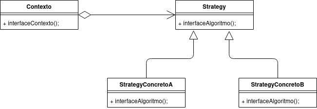
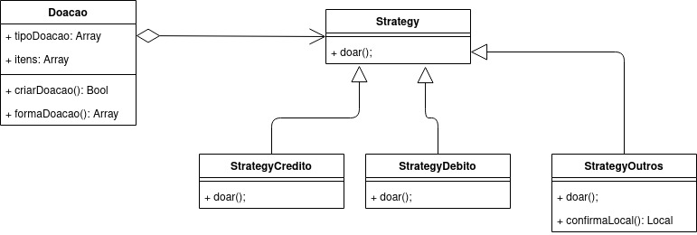

# GoF Comportamental

O padrão GoF Comportamental resumidamente atua sobre qual o comportamento das entidades, ou seja, quais são as responsabilidades que são atribuídas a cada uma das entidades.

## Strategy

Esse padrão de projeto de forma clara é o que delega as responsabilidades adquiridas pelas entidades, atribuindo, portanto, o comportamento. Assim a comunicação entre os objetos é aprimorada, pois há a distribuição das responsabilidades. O objetivo é representar uma operação a ser realizada sobre os elementos de uma estrutura de objetos.

Esse padrão é facilmente implementado utilizando as classes abstratas e/ou interfaces da programação orientada a objetos. O contexto relaciona-se com a parte mais abstrata, onde ainda não se sabe o como deve ser feito, apenas com quem. Dessa forma, cabe a camada mais concreta a implementação do método em si, fornecendo uma escalabilidade maior ao software, onde novas soluções para aquele contexto são facilmente acopladas ao sistema.

O Strategy geralmente descreve diferentes maneiras de fazer a mesma coisa, permitindo que você troque esses algoritmos dentro de uma única classe contexto. Ele trabalha a nível de objeto, permitindo que você troque os comportamentos durante a execução.

## Pontos Positivos

- Melhoria da manutenção do código o qual é frequentemente usado durante o desenvolvimento de uma aplicação

## Pontos Negativos

- Necessidade de conjuntos de classe para serem usadas em execução
- Vários níveis de abstração, pode se fazer necessário em determinado contexto, porém isso poderá impactar significativamente na performance da aplicação.

### É possível adaptar esse padrão para o projeto?

É possível sua utilização no projeto, visto que temos formas de doação, dessa forma com o uso do Strategy podemos definir diferentes responsabilidades para cada forma de doação.

### Strategy Base

### Strategy Projeto

## Template Method

Esse padrão tenta quebrar o algoritimo que resolve um problema em uma serie de passos a serem concluidos, esses passos se tornam metodos, a serem utilizados, que são chamados dentro de um metodo template.

Com isso podemos resolver o problema que foi descrito de varias maneiras, como por exemplo um pagamento onde pode ser por cartão de credito ou boleto, tem as mesmas etapas mas o que acontece especificamente nos metodos pode ser sobrescrito.

Desse modo o padrão de metodo template, nos permite fazer a reutilização do codigo sem perder o controle do algoritimo.

## Pontos Positivos

- Melhor controle de proceços para um certo problema.
- Uma maior facilidade para poder criar uma nova forma de solucionar um certo problema.
- Reutilização de codigo ja escrito.

## Pontos Negativos

- A aplicação desse padrão é muito ligada á processos que pode ter varias soluções, não sendo um padrão generalizado.
- Os passos do processo a ser solucionado tem que ser previamente conhecido para que esse padrão possa ser aplicado.

### É possível adaptar esse padrão para o projeto?

É possível sua utilização no projeto, visto que temos diferentes formas de doação, dessa forma com o uso do template method podemos definir diferentes formas de doação.

### Template Method Base

<iframe frameborder="0" style="width:100%;height:264px;" src="https://viewer.diagrams.net/?highlight=000000&layers=1&nav=1&title=TemplateMethodBase#Uhttps%3A%2F%2Fdrive.google.com%2Fuc%3Fid%3D1N-MC2pehbniwZAW6JEz6MxFTxfmU9Iym%26export%3Ddownload"></iframe>

### Template Method Projeto

<iframe frameborder="0" style="width:100%;height:2px;" src="https://viewer.diagrams.net/?tags={}&highlight=000000&layers=1&nav=1&title=TemplateMethodProjeto#Uhttps%3A%2F%2Fdrive.google.com%2Fuc%3Fid%3D1Qub2XVbIbt9f-6hFv4DwgdA1-x6s5J1s%26export%3Ddownload"></iframe>

## Versionamentos

|Data|Versão|Descrição|Autor|
|:--------:|:---:|:-------------------: |:-----------------------:|
|09/09/2021| 0.1 | Criação do documento | Pedro Vítor de Salles Cella |
|11/09/2021| 0.2 | Adição do Template Method | Paulo Gonçalves Lima |

## Referências

- Site: <https://pt.wikipedia.org/wiki/Strategy>
- Repositório: <https://unbarqdsw.github.io/2020.1_G12_Stock/#/Project/Estudos/comportamental?id=strategy>
- Site: <http://www.macoratti.net/08/08/net_stgy.htm>
- Site: <https://refactoring.guru/design-patterns/template-method>
- Video Aula 10c Milene serrano
