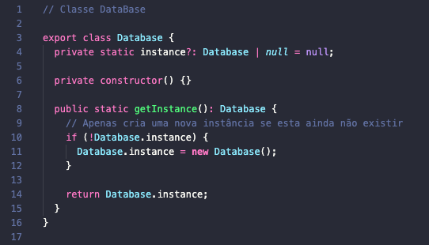
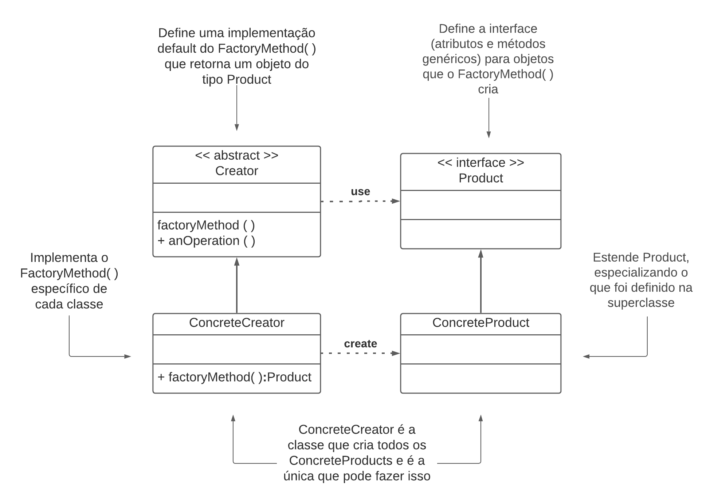
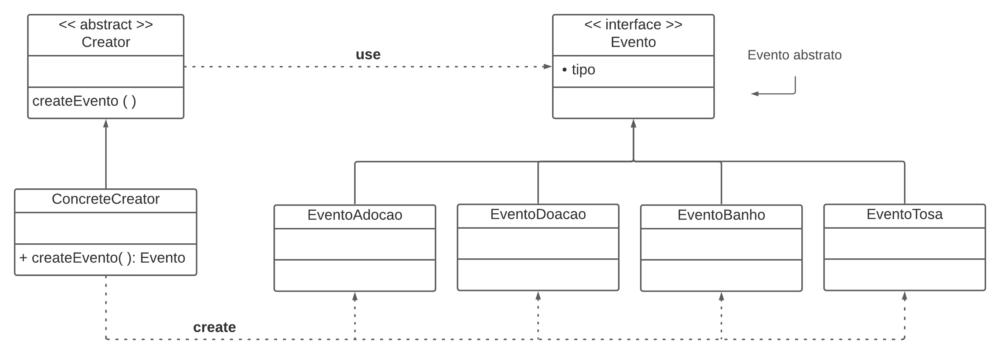
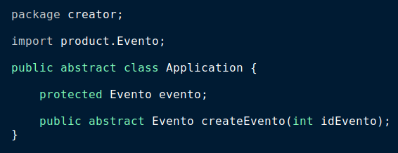
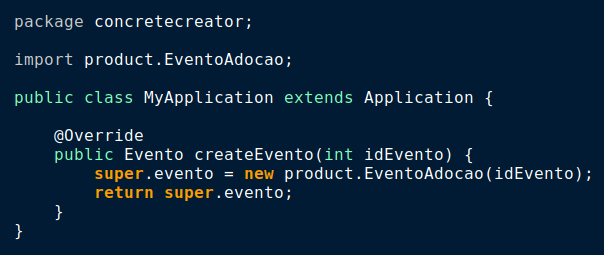
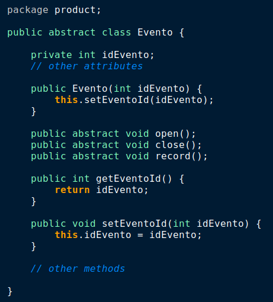
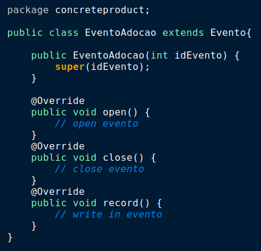

# GoFs Criacionais

Os padrões GoF Criacionais são utilizados quando existe uma hierarquia que é muito acessada e têm muitas criações de instâncias sendo demandadas para ela, o que geralmente é complicado de ser administrado. Também atuam em dois principais problemas:

- "Definir qual classe concreta deve ser utilizada para criar o objeto"
- "Definir como os objetos devem ser criados e como eles se
  relacionam com outros objetos do sistema"

Ciente disto a equipe escolheu os seguites GoFs criacionais:

## Singleton

<p>O Singleton é considerado como um (anti)-padrão de projeto, isso se deve ao fato dele seguir uma metodologia contrária aos outros padrões. Basicamente sua implementação garante que só exista uma instância daquele objeto. Sua implementação serve para programas que necessitam que um objeto seja instanciado uma única vez, um bom exemplo disso é um Banco de Dados, nele serão feitos diversos acessos e seu desempenho seria afetado caso a chamada para o mesmo gerasse sempre uma nova instância. Por este motivo o uso de um Singleton garante essa evasão, também garantindo que qualquer local da aplicação possa acessá-lo.</p>

#### Pontos Positivos

- Garante que nenhuma outra classe crie novas instâncias, sem necessidade.
- Auxilia no Desempenho.
- Ganha um ponto de acesso global para aquela instância.

#### Pontos Negativos

- Nenhuma outra classe pode instanciá-la, é necessário que sua própria classe a instancie.
- Pode mascarar um desing ruim, onde um componente sabe muito sobre outro.

#### É possível usar no projeto?

- Sim, visto que assim como no exemplo, também temos um banco de dados, garantindo desempenho duarante o uso do banco.

### Singleton Base

<iframe frameborder="0" style="width:100%;height:500px;" src="https://viewer.diagrams.net/?tags={}&highlight=000000&layers=1&nav=1&title=Singleton%20Base#Uhttps%3A%2F%2Fdrive.google.com%2Fuc%3Fid%3D1ek59B6J7Ddlo4yD7pJuVwguPnOfs2pVz%26export%3Ddownload"></iframe>

### Singleton Projeto

#### A nível de modelagem

<iframe frameborder="0" style="width:100%;height:500px;" src="https://viewer.diagrams.net/?tags={}&highlight=000000&layers=1&nav=1&title=Singleton%20Projeto#Uhttps%3A%2F%2Fdrive.google.com%2Fuc%3Fid%3D1oUqkK33QCT20yyZGkXfmdpyATDGJpBqx%26export%3Ddownload"></iframe>

#### A nível de código



## Factory Method

O Padrão Factory Method tem como objetivo auxiliar na redução do acoplamento do software, assim como no padrão de [Mediator](../gofComportamental/gofComportamental.md#Mediator). Para isso são retiradas as dependências explícitas através do encapsulamento da escolha da classe concreta a ser utilizada na criação de objetos de um determinado tipo. Assim a instanciação é delegada às subclasses. Este padrão deve ser usado, principalmente, quando uma classe não pode antecipar ou conhecer a classe dos objetos que deve criar e quando uma classe quer suas subclasses para especificar os objetos que cria.

#### Pontos Positivos

- O principal ponto positivo é o baixo acoplamento. Se a implementação de um Product for alterado, não afeta sua Creator, pois a Creator não está fortemente ligada a alguma ConcreteProduct.
- Há também uma melhora na coesão, já que cada classe tem funções específicas e bem definidas.
- Maior flexibilidade para as classes.
- Para acrescentar novos tipos concretos basta criar uma nova classe ConcreteCreator, sem alterar as demais, apenas
  criando instâncias para esse ConcreteProductX() no método createProduct() de ConcreteCreator. Portanto, ganhamos em reutilização, manutenibilidade, coesão, dentre outros aspectos relevantes para a programação de sistemas Orientados a Objetos.

#### Pontos Negativos

- Especializar uma classe apenas para instanciar um objeto de uma subclasse de outra superclasse acaba sendo muito trabalho desnecessário, por isso deve-se analizar com cautela se o padrão é adequado para o projeto em questão.

#### É possível usar no projeto?

- Sim, como mostra no exemplo, no projeto a classe Eventos pode ser de alguns tipos diferentes e cada um pode possuir propriedades individuais. Para baixar o nível de acoplamento e repetição de código, pode ser utilizado o Factory Method.

### Factory Method Base



### Factory Method Projeto

#### A nível de modelagem



#### A nível de código

<span>CREATORS</span>
<div styles="width: 100%; display: flex; align-items: center">
  
  
</div>

<span>PRODUCTS</span>
<div styles="width: 100%; display: flex;">
  
  
</div>

## Abstract Factory

<p>Esse padão de projeto sugere que se deve explicitamente criar uma interface para cada variação de um produto.</p>
<p>Tem como o objetivo isolar a criação dos objetos do seu uso e criar famílias de objetos relacionados sem depender das classes concretas.</p>

#### Pontos Positivos

- Evita a acoplação entre os produtos concretos e o codigo do cliente.
- Pode incluir novas variantes sem quebrar o codigo existente.
- Extrai a criação do produto para um lugar, fazendo o codigo ser mais facil de ter suporte.

#### Pontos Negativos

- O codigo pode se tornar mais complicado que deveria, ja que novas interfaces e classes são introduzidas junto com o padrão.

#### É possível usar no projeto?

É possivel a utilização, pois no caso de criação de eventos temos diversos tipos de eventos que precisam ser criados.

#### A nível de modelo

### Abstract Factory Base

<iframe frameborder="0" style="width:100%;height:500px;" src="https://viewer.diagrams.net/?tags={}&highlight=0000ff&layers=1&nav=1&title=Abstract%20Factory%20Base#Uhttps%3A%2F%2Fdrive.google.com%2Fuc%3Fid%3D1Bdmn4WVo7Au1DQzjRgwFcXYlUgNlxj7t%26export%3Ddownload"></iframe>

### Abstract Factory Projeto

<iframe frameborder="0" style="width:100%;height:500px;" src="https://viewer.diagrams.net/?tags={}&highlight=0000ff&layers=1&nav=1&title=Abstract%20Fatory%20Projeto#Uhttps%3A%2F%2Fdrive.google.com%2Fuc%3Fid%3D1zaLFZURbo-HfaTTqQ4NUhU5Bkt3sPnME%26export%3Ddownload"></iframe>

#### A nível de código

```js
import {Animal} from ../Animal

export interface EventoFactory{
  createCause(animalCause: string, description: string): Animal;
  verificarEvento(obj: Evento): Evento;
}
```

~~~javascript
import {Animal} from ../Animal

export class CreateEventoAdocaoFactory{
  createCause(animalCause: string, description: string): Animal{
    create new Animal(animalCause);
  };
  verificarEvento(obj: Evento): Evento{
    // implement function that verify if event already exits
  };
}
~~~

~~~javascript
import {Animal} from ../Animal

export class CreateEventoBanhoFactory{
  createCause(animalCause: string, description: string): Animal{
    create new Animal(animalCause);
  };
  verificarEvento(obj: Evento): Evento{
    // implement function that verify if event already exits
  };
}
~~~

~~~javascript
import {Animal} from ../Animal

export class CreateEventoTosaFactory{
  createCause(animalCause: string, description: string): Animal{
    create new Animal(animalCause);
  };
  verificarEvento(obj: Evento): Evento{
    // implement function that verify if event already exits
  };
}
~~~

~~~javascript
import {Animal} from ../Animal

export class CreateEventoDoacaoFactory{
  createCause(animalCause: string, description: string, valor: double): Animal{
    create new Animal(animalCause);
  };
  verificarEvento(obj: Evento): Evento{
    // implement function that verify if event already exits
  };
}
~~~

~~~javascript
import {CreateEventoDoacaoFactory} from ../EventoDoacao;
import {CreateEventoAdocaoFactory} from ../EventoAdocao;

const eventoSilvestre = new CreateEventoDoacaoFactory();
const eventoDomestico = new CreateEventoAdocaoFactory();

const evento1 = eventoSilveste.CreateEventoDoacaoFactory("mico leao", "evento para arrecadar...", 1000.00);
const evento2 = eventoDomestico.CreateEventoAdocaoFactory("cachorro", "evento para doacoes...");

~~~
## Prototype

<p>Esse padrão de projeto prossibilita a criação de novos objetos a partir da cópia de objetos existentes.</p>
<p>Tem como intenção especificar os tipos de objetos a serem criados usando uma instância-protótipo e criar novos objetos pela cópia desse protótipo.</p>

#### Pontos Positivos

- Acrescenta e remove produtos em tempo de execução;
- Especifica novos objetos pela variação de valore sou estrutura;
- Reduz do número de subclasses;
- Configura dinamicamente uma aplicação com classes.

#### Pontos Negativos

- Implementação da operação Clone em cada subclasse do Prototype.

#### É possível usar no projeto?

Sim, é possivel utilizarmos o conceito de protótipo na criação de eventos, como eventos presencias e virtuais.

### Prototype Base

<iframe frameborder="0" style="width:100%;height:500px;" src="https://viewer.diagrams.net/?tags={}&highlight=0000ff&edit=_blank&layers=1&nav=1&title=Prototype%20Base.drawio#Uhttps%3A%2F%2Fdrive.google.com%2Fuc%3Fid%3D1WMCZ95SNYxnvo93w8W4xWJi_2BvJdZ29%26export%3Ddownload"></iframe>

### Prototype Projeto

#### A nível de modelo

<iframe frameborder="0" style="width:100%;height:500px;" src="https://viewer.diagrams.net/?tags={}&highlight=0000ff&edit=_blank&layers=1&nav=1&title=Prototype%20Projeto.drawio#Uhttps%3A%2F%2Fdrive.google.com%2Fuc%3Fid%3D1KRI-TcggXUQFKQ5WAfADm97XzHn9qZDT%26export%3Ddownload"></iframe>

#### A nível de código

```typescript
export interface PrototypeEvento {
    clone(): PrototypeEvento;
}

export class EventoPresencial implements PrototypeEvento {

    constructor(
        public dtInicio: Date,
        public dtFinal: Date,
        public hrInicial: Date,
        public hrFinal: Date,
        public titulo: string,
        public descricao: string,
        public cidade: string,
        public cep: number,
        public complemento: string,
        public bairro: string) { }

    clone(): EventoPresencial {
        const newObj = new EventoPresencial(
            this.dtInicio,
            this.dtFinal,
            this.hrInicial,
            this.hrFinal,
            this.titulo,
            this.descricao,
            this.cidade,
            this.cep,
            this.complemento,
            this.bairro);
        return newObj;
    }

    verificarEvento(): void {
        console.log(
            `O evento ${this.titulo} ira ocorrer em ${this.cidade}`,
            `no bairro ${this.bairro} no dia ${this.dtInicio} as`,
            `${this.hrInicial} até o dia ${this.dtFinal} as ${this.hrFinal}`);
    }
}

export class EventoOnline implements PrototypeEvento {

    constructor(
        public titulo: string,
        public descricao: string,
        public itemDoado: string,
        public contato: string) { }

    clone(): EventoOnline {
        const newObj = new EventoOnline(
            this.titulo,
            this.descricao,
            this.itemDoado,
            this.contato);
        return newObj;
    }
    verificarEvento(): void {
        console.log(
            `O evento ${this.titulo} daoara ${this.itemDoado}`,
            `e o doador pode ser contatado por: ${this.contato}`);
    }
}
```

## Versionamentos

|    Data    | Versão |                    Descrição                     |                            Autor                             |
| :--------: | :----: | :----------------------------------------------: | :----------------------------------------------------------: |
| 11/09/2021 |  0.1   | Criação do documento, adição do Padrão Singleton |      Paulo Gonçalves Lima, Pedro Vítor de Salles Cella       |
| 12/09/2021 |  0.2   |           Revisão do Padrão Singleton            |                       Gabriela Pivetta                       |
| 12/09/2021 |  0.3   |  Adição da descrição geral dos GoFs Criacionais  |                       Gabriela Pivetta                       |
| 12/09/2021 |  0.4   |         Adição do Padrão Factory Method          |                       Gabriela Pivetta                       |
| 14/09/2021 |  0.5   |        Adição do Padrão Abstract Factory         |                     Paulo Gonçalves Lima                     |
| 16/09/2021 |  0.6   |         Revisão do Padrão Factory Method         |                     Paulo Gonçalves Lima                     |
| 16/09/2021 | 0.6.1  |         Revisão textual e de formatação          | Arthur Sena, Vinícius Vieira, Antonio Ruan, Gabriela Pivetta |
| 16/09/2021 |  0.7   |   Adição do padrão singleton a nível de código   |                         Arthur Sena                          |
| 16/09/2021 |  0.8   |   Adição do padrão Factory Method a nível de código   |                         Gabriela Pivetta                         |
| 17/09/2021 |  0.9   |   Adição do padrão Prototype   |                         Antonio Ruan                        |
| 17/09/2021 |  0.10   |   Atualização iframe abstract factory e adição nivel de código   |                         Vinícius Vieira                        |

## Referências

- SERRANO, Milene. Vídeo aulas sobre Padrões de Projeto. Último acesso em 12/09/2021.
- Gamma, Erich. et al. Padrões de Projeto: Soluções reutilizáveis de software orientado a objetos. 1ª Edição. Porto Alegre: Bookman, 2007.
- [Refactoring Guru](https://refactoring.guru/design-patterns/singleton)
- [Grupo STOCK](https://unbarqdsw.github.io/2020.1_G12_Stock/#/Project/EstudoDirigido?id=estudos)
- [Dev Media](https://www.devmedia.com.br/patterns-factory-method/18954)
- [Wikpedia Factory Pattern](https://en.wikipedia.org/wiki/Abstract_factory_pattern)
- [Refactoring Guru Factory Method](https://refactoring.guru/design-patterns/factory-method)
- [Playlist Sobre Padrões de Projeto](https://youtube.com/playlist?list=PLbIBj8vQhvm0VY5YrMrafWaQY2EnJ3j8H) 
