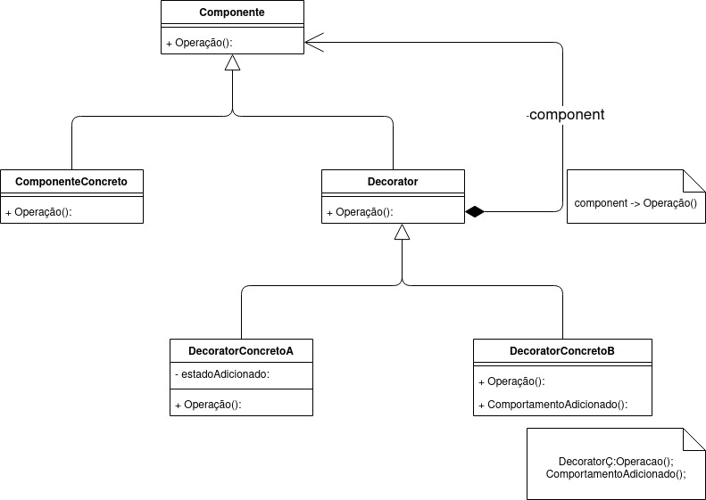
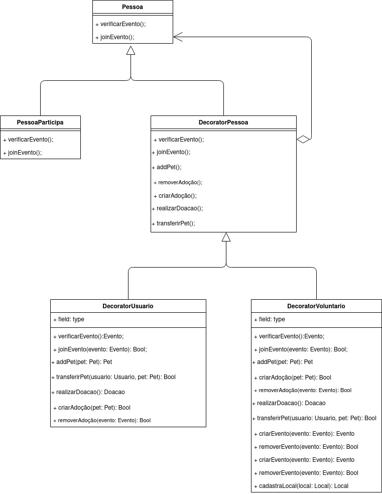

# GoF Estrutural

O padrão GoF de estrutura tem um foco em como objetos e classes são compostos para formar estruturas maiores. A flexibilidade obtida pela composição de objetos provém da capacidade de mudar a composição em tempo de execução o que não é possível com a composição estática. Esse padrão tem um foco em diminuir a dependência de um sistema gerada pela interação de seus objetos, facilitando assim sua manutenção/evolução.

## Decorator

O padrão Decorator adiciona funcionalidades a objetos de forma dinâmica (em tempo de execução), permitindo assim a expansão do objeto de maneira mais flexível, ou seja, utilizando esse padrão nós podemos expandir uma instância sem precisar utilizar herança, somente composição, algo que é não somente recomendado na orientação a objetos como também um princípio. Basicamente o Decorator envelopa um objeto para fornecer novos comportamentos.

### Pontos Positivos

- Facilidade na compreensão
- Facilidade na aplicação
- Capacidade de adicionar diversos comportamentos
- Poder adicionar e remover comportamentos em tempo de execução

### Pontos Negativos

- Dificuldade na compreensão do código

### É possível adaptar esse padrão para o projeto?

Sim, dentro do projeto existe uma variação nas categorias do tipo de pessoa o qual irá comparecer o evento, sendo o tipo usuário o qual aproveita dos serviços ofertados e o tipo voluntário que participa trabalhando dos serviços ofertados. Dessa forma u Decorator poderá servir para implementar esses dois comportamentos.

### Decorator Base

### Decorator Projeto

## Adapter

Esse padrão de projeto, é um padrão q permite que uma inteface de uma classe existente seja usada como uma outra interface.

Ela é usada normalmente comom uma forma de fazer outras classes funcionarem sem ter que modificar o codigo fonte.

### Pontos Positivos

- Faz com que classes possam ser reutilizadas para uma interface que o cliente requer.
- Faz com que se possa introduzir novos tipos de adaptadores sem que quebre o codigo fonte.

### Pontos Negativos

- Pode aumenta a complexidade do codigo, pois se é introduzido novos conjuntos de interfaces e classes

### É possível utilizar esse padrão para o projeto?

Não será necessario a utilização desse padrão, pois como estamos construindo todo o projeto do zero, não seria necessario a criação de adpters para interfaces ja existentes.

### Adapter Base

<iframe frameborder="0" style="width:100%;height:500;" src="https://viewer.diagrams.net/?tags={}&highlight=0000ff&layers=1&nav=1&title=Adapter%20base#Uhttps%3A%2F%2Fdrive.google.com%2Fuc%3Fid%3D1nNK93rKBx29pL-MQizBiRo8VODXcrGMJ%26export%3Ddownload"></iframe>

## Facede

## Versionamentos

|Data|Versão|Descrição|Autor|
|:--------:|:---:|:-------------------: |:-----------------------:|
|08/09/2021| 0.1 | Criação do documento | Pedro Vítor de Salles Cella |
|08/09/2021| 0.2 | Adição do Decorator  | Pedro Vítor de Salles Cella |
|11/09/2021| 0.2 | Adição do Adapter  | Paulo Gonçalves Lima |

## Referências

- Site: <https://pt.wikipedia.org/wiki/Padr%C3%A3o_de_projeto_de_software#Padr%C3%B5es_estruturais>
- Repositório: <https://unbarqdsw.github.io/2020.1_G12_Stock/#/Project/Estudos/estrutural>
- Site: <https://www.devmedia.com.br/design-patterns-padroes-gof/16781>
- Site: <http://www.macoratti.net/13/02/net_decor1.htm>
- Site: <https://en.wikipedia.org/wiki/Adapter_pattern>
- Site: <https://refactoring.guru/design-patterns/adapter>
