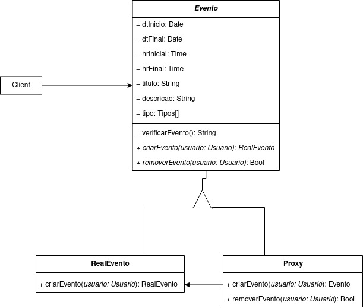

# GoFs Estruturais

Os padrões GoFs de estrutura têm seu foco em como objetos e classes são compostos para formar estruturas maiores. A flexibilidade obtida pela composição dinâmica de objetos provém da capacidade de mudar a composição em tempo de execução o que não é possível com a composição estática. Visam diminuir a dependência de um sistema gerada pela interação de seus objetos, facilitando assim sua manutenção e escalabilidade.

## Decorator

O padrão Decorator adiciona funcionalidades a objetos de forma dinâmica (em tempo de execução), permitindo assim a expansão do objeto de maneira mais flexível, ou seja, utilizando esse padrão nós podemos expandir uma instância sem precisar utilizar herança, somente composição, algo que é não somente recomendado na orientação a objetos como também um princípio da mesma. Basicamente o Decorator envelopa um objeto para fornecer novos comportamentos.

#### Pontos Positivos

- Facilidade na aplicação
- Capacidade de adicionar diversos comportamentos
- Poder adicionar e remover comportamentos em tempo de execução

#### Pontos Negativos

- Dificuldade na compreensão do código
- Quanto mais decorators em camadas, mais complexo seu código se torna

#### É possível adaptar esse padrão para o projeto?

Sim, dentro do projeto existe uma variação nas categorias do tipo de pessoa o qual irá comparecer o evento, sendo o tipo usuário o qual aproveita dos serviços ofertados e o tipo voluntário que participa trabalhando dos serviços ofertados. Dessa forma u Decorator poderá servir para implementar esses dois comportamentos.

### Decorator Base


### Decorator Projeto

#### A nível de modelagem


#### A nível de código

```js

export class Pessoa{
  this.verificarEvento(filters: Event): List[Event];
  this.joinEvento(obj: Evento): Evento;
}
```

```js
export interface DecoratorPessoa extends Pessoa {
  addPet(){}

  removerAdocao(): Void{}

  criarAdocao(): Void{}

  realizarDoacao(): Void{}

  transferirPet(): Void{}
  
}
```

```js
export class DecoratorUsuario extends DecoratorPessoa {
  addPet(pet: Pet): Pet{}

  removerAdocao(evento: Evento): bool{}

  criarAdocao(pet: Pet): bool{}

  realizarDoacao(): Doacao{}

  transferirPet(usuario: Usuario, pet: Pet): Void{}
}
```

```js
export class DecoratorUsuario extends DecoratorVoluntario {
  criarEvento(evento: Evento): Evento{} 

  removerEvento(evento: Evento): Bool {}

  cadstrarLocal(local: Local): Local {}

  addPet(pet: Pet): Pet{}

  removerAdocao(evento: Evento): bool{}

  criarAdocao(pet: Pet): bool{}

  realizarDoacao(): Doacao{}

  transferirPet(usuario: Usuario, pet: Pet): Void{}
}

```

## Adapter

Esse padrão de projeto permite a conversão uma inteface de uma classe existente em outra. Utilizada para permitir a comunicação entre classes que são incompatíveis (ex.: libs, plugins, códigos legado).

#### Pontos Positivos

- Faz com que classes possam ser reutilizadas para uma interface que o cliente requer
- Faz com que se possa introduzir novos tipos de adaptadores sem que o código fonte quebre

#### Pontos Negativos

- Pode aumentar a complexidade do código, pois são introduzidos novos conjuntos de interfaces e classes

#### É possível utilizar esse padrão para o projeto?

O esperado é que este padrão não se faça necessário, considerando que o projeto está sendo construído do início, não existem interfaces prévias.

### Adapter Base

<iframe frameborder="0" style="width:100%;height:500px;" src="https://viewer.diagrams.net/?tags={}&highlight=0000ff&layers=1&nav=1&title=Adapter%20base#Uhttps%3A%2F%2Fdrive.google.com%2Fuc%3Fid%3D1nNK93rKBx29pL-MQizBiRo8VODXcrGMJ%26export%3Ddownload"></iframe>

## Facade

Esse padrão de projeto serve como uma interface/máscara para uma estrutra de código mais complexa. Cria pontos de entrada para determinadas partes do sistema, como serviços externos, camadas da aplicação e objetos complexos dentro em determinadas partes do código.

#### Pontos Positivos

- Consegue isolar o código da complexidade dos subsistemas
- As dependências dos subsistemas serão possivelmentes minimizadas
- Subsistemas são mais fáceis de serem utilizados

#### Pontos Negativos

- Pode se tornar um [objeto deus](https://en.wikipedia.org/wiki/God_object)

#### É possível utilizar esse padrão para o projeto?

É, porém ainda não necessária, já que o projeto não possui subsistemas complexos o suficientes para a implementação de uma fachada.

### Facede Base

<iframe frameborder="0" style="width:100%;height:500px;" src="https://viewer.diagrams.net/?tags={}&highlight=0000ff&layers=1&nav=1&title=Facade%20Base#Uhttps%3A%2F%2Fdrive.google.com%2Fuc%3Fid%3D1lVHbGQwmJsBhUOxOhxa-FYy9FbISRQWb%26export%3Ddownload"></iframe>

## Proxy

O proxy controla a chamada a um objeto através de outro objeto de mesma interface.

O padrão Proxy é aplicável sempre que há necessidade de uma referência mais versátil, ou sofisticada, do que um simples apontador para um objeto. É aplicável nos seguintes contextos:

- Remote proxy: fornece um representante local para um objeto num espaço de endereçamento diferente.
- Virtual proxy: cria objetos caros sob demanda
- Protection proxy: controla o acesso ao objeto original.
- Smart reference: é um substituto para um simples pointer que executa ações adicionais quando um objeto é acessado.

#### Pontos Positivos

- Possibilita a inclusão de tarefas adicionais de organização (housekeeping) quando um objeto é acessado
- Ocultar o fato de que um objeto reside num espaço de endereçamento diferente.
- Criação de um objeto sob demanda.

#### Pontos Negativos

- Aumento da complexidade

#### É possível utilizar esse padrão para o projeto?

Sim. Podemos utilizar o proxy no contexto do Protection proxy para a implementação de permissões na criação de um evento.

### Proxy Base


### Proxy Projeto

#### A nível de modelagem



#### A nível de código

```typescript
abstract class Evento {
  public dtInicio: Date;
  public dtFinal: Date;
  public hrInicial: Date;
  public hrFinal: Date;
  public titulo: string;
  public descricao: string;
  public tipos[]: Tipo[];
 
  verificarEvento(): String {
    let res = 
      `O evento ${titulo} ocorrera no dia ${dtInicio} as ${hrInicial} `+
      `ate o dia ${dtFinal} as ${hrFinal}, e possui os seguintes tipos:\n`;
    for(int i = 0; i < tipos.length; i++)
      res += `-> ${tipos[i]}\n`
    return res;
  }

  abstract criarEvento(usuario: Usuario): RealEvento;
  abstract removerEvento(usuario: Usuario): void;
}

class RealEvento extends Evento{
  constructor(
    public dtInicio: Date,
    public dtFinal: Date,
    public hrInicial: Date,
    public hrFinal: Date,
    public titulo: string,
    public descricao: string,
    public tipos[]: Tipo[]){}
}

class Proxy extends Evento{

  #evento: RealEvento

  public criarEvento(usuario: Usuario): RealEvento{
    if(usuario.voluntario === True)
    {
      evento = new RealEvento(
        public dtInicio: Date,
        public dtFinal: Date,
        public hrInicial: Date,
        public hrFinal: Date,
        public titulo: string,
        public descricao: string,
        public tipos[]: Tipo[]);
      return evento;
    }
  }

  public removerEvento(usuario: Usuario): Bool{
    if(usuario.voluntario === True)
    {
      delete evento;
      return true;
    }
    return false;
  }
}

```

## Versionamentos

|    Data    | Versão |        Descrição         |             Autor              |
| :--------: | :----: | :----------------------: | :----------------------------: |
| 08/09/2021 |  0.1   |   Criação do documento   |  Pedro Vítor de Salles Cella   |
| 08/09/2021 |  0.2   |   Adição do Decorator    |  Pedro Vítor de Salles Cella   |
| 11/09/2021 |  0.3   |    Adição do Adapter     |      Paulo Gonçalves Lima      |
| 14/09/2021 |  0.4   |     Adição do Facade     |      Paulo Gonçalves Lima      |
| 16/09/2021 | 0.4.1  | Revisão e adição textual | Arthur Sena e Gabriela Pivetta |
| 16/09/2021 | 0.5  | Adição do nível de código do Decorator | Paulo Gonçalves Lima, Pedro Vítor de Salles |
| 20/09/2021 | 0.6  | Adição do Proxy | Antonio Ruan |

## Referências

- Gamma, Erich. et al. Padrões de Projeto: Soluções reutilizáveis de software orientado a objetos. 1ª Edição. Porto Alegre: Bookman, 2007.
- [Playlist Sobre Padrões de Projeto](https://youtube.com/playlist?list=PLbIBj8vQhvm0VY5YrMrafWaQY2EnJ3j8H)
- [Wikipedia, Padrões de Projeto](https://pt.wikipedia.org/wiki/Padr%C3%A3o_de_projeto_de_software#Padr%C3%B5es_estruturais)
- [Wikipedia, Adapter Pattern](https://en.wikipedia.org/wiki/Adapter_pattern)
- [Wikipedia, Facade Pattern](https://en.wikipedia.org/wiki/Facade_pattern)
- [Refactoring Guru Adapter](https://refactoring.guru/design-patterns/adapter)
- [Refactoring Guru Facade](https://refactoring.guru/design-patterns/facade)
- [Macoratti](http://www.macoratti.net/13/02/net_decor1.htm)
- [Dev Media](https://www.devmedia.com.br/design-patterns-padroes-gof/16781)
- [Grupo Stock](https://unbarqdsw.github.io/2020.1_G12_Stock/#/Project/Estudos/estrutural)
