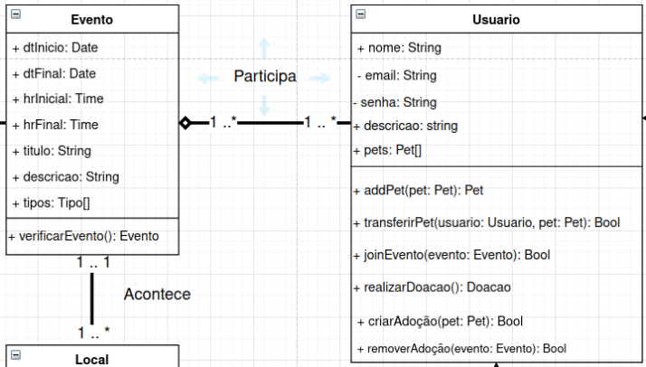
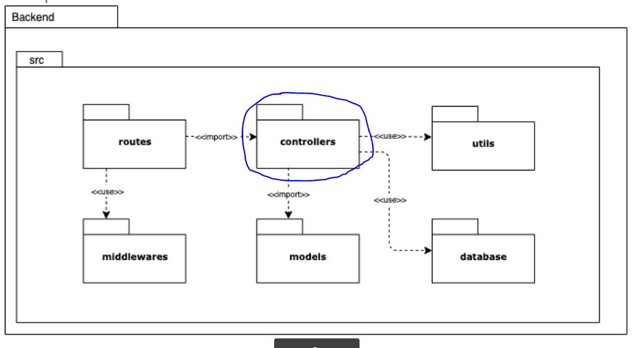
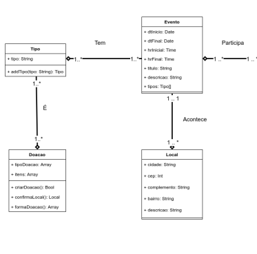
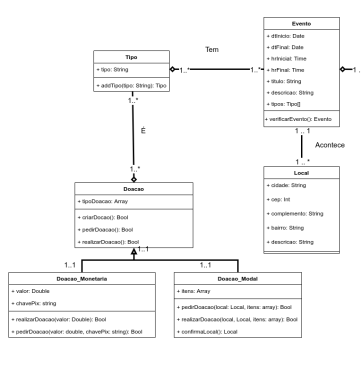

# Escolha de GRASPs

## GRASP Especialista

Para a aplicação do padrão especialista, foram revistos os métodos do diagrama de classe e a seguinte alteração foi feita: Realocação do método verificarEvento().

O método verificar Evento depende das informações presentes no evento, assim o padrão especialista recomenda que sua implementação seja feita na classe Evento, com isso seguimos as recomendações do padrão de baixo acoplamento também.

- Antes

- Depois

## GRASP Controlador

A princípio para a utilização desse padrão não foi vista necessidade de alterar artefatos anteriores.

Conforme é verificado no Diagrama de Pacotes, com o uso do pacote "controllers" tem-se a implementação desse padrão. Este se dá pelo uso desta estrutura de pastas composta por cada uma das classes que delegarão todos os eventos relacionados a cada uma delas. Por exemplo haverá uma controller para a classe Usuario, outra para a classe Doacao e assim por diante. Essa implementação é adequada pois melhora a manutenabilidade do produto.

## GRASP Polimorfismo 
Para a utilização desse padrão, foram realizadas mudanças no Diagrama de Classes, que se basearam na aplicação de Herança entre as classes filhas (Doacao_Monetaria e Doacao_Modal) com a classe abstrata pai (Doacao). A implementação desse padrão aumenta a manutenabilidade do produto.

- Antes

- Depois

# Referências bibliográficas
[Análise sobre a ISO 9126](https://www.tiespecialistas.com.br/analise-sobre-iso-9126-nbr-13596/). Acessado em 16 de setembro de 2021;

# Histórico de  versão
|Data|Versão|Descrição|Autor(es)|
|:--------:|:---:|:-------------------: |:-----------------------:|
|14/09/2021 | 0.1 | Criação do documento e adição do tópico Especialista | Antonio Ruan |
|14/09/2021 | 0.2 | Adição do tópico Controlador | Vinícius Souza |
|14/09/2021 | 0.3 | Adição do tópico Polimorfismo | Victor Samuel |
|15/09/2021 | 0.4 | Revisão e atualização do documento | Gabriela Pivetta, Arthur Sena |
|16/09/2021 | 0.5 | Revisão do documento, correção das rotas das imagens, correções ortográficas e ajuste de texto | Edvan Gomes, Sara Campos, Júlio Schneider |
