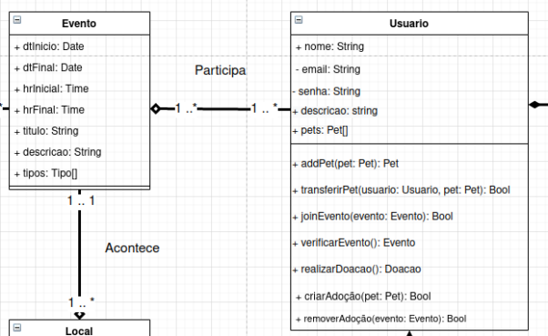
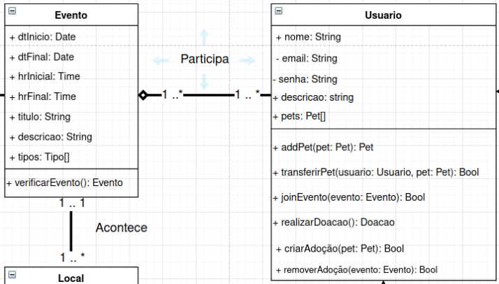
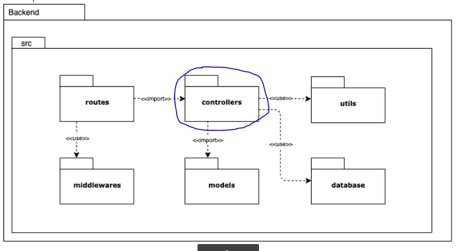
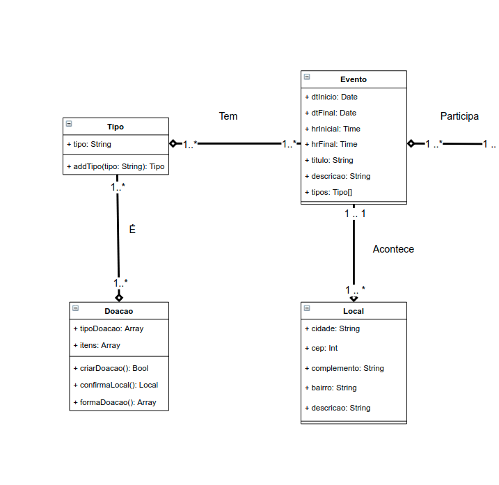
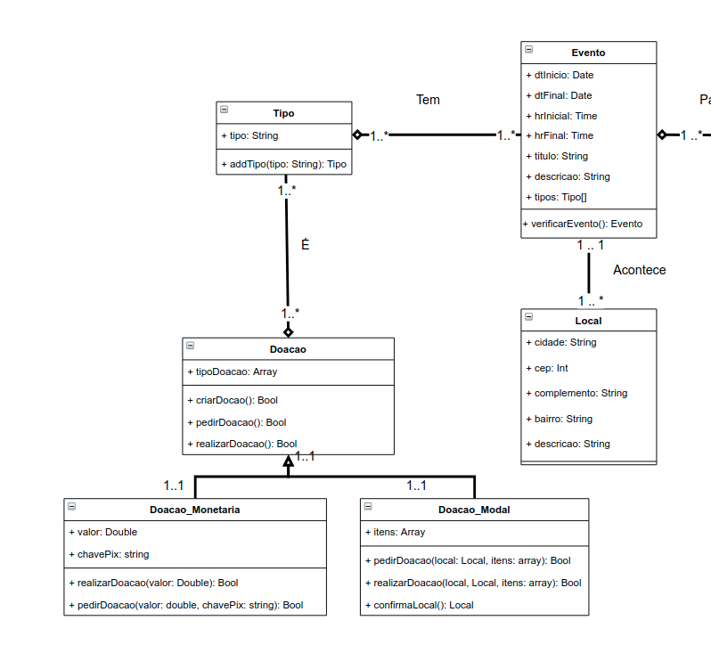
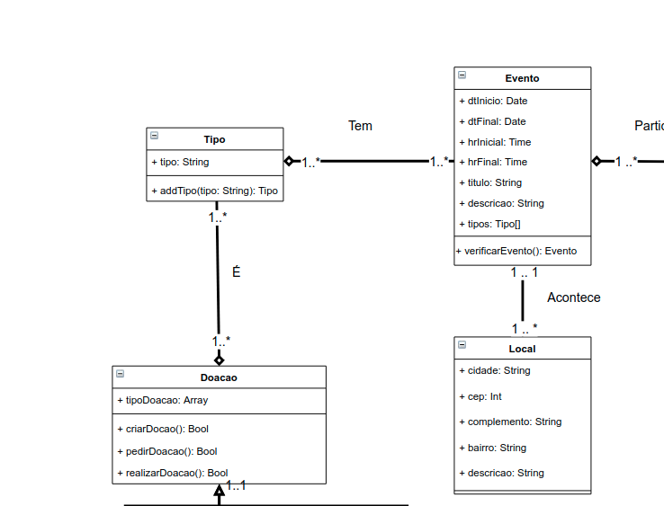

# Escolha de GRASPs

## Padrões Escolhidos
  - Especialista
  - Controlador 
  - Polimorfismo 
  - Indireção 

## GRASP Especialista

Para a aplicação do padrão especialista, foram revistos os métodos do diagrama de classe e a seguinte alteração foi feita: Realocação do método verificarEvento().

O método verificar Evento depende das informações presentes no evento, assim o padrão especialista recomenda que sua implementação seja feita na classe Evento, com isso seguimos as recomendações do padrão de baixo acoplamento também.

- Antes

- Depois

## GRASP Controlador

A princípio para a utilização desse padrão não foi vista necessidade de alterar artefatos anteriores.

Conforme é verificado no Diagrama de Pacotes, com o uso do pacote "controllers" tem-se a implementação desse padrão. Este se dá pelo uso desta estrutura de pastas composta por cada uma das classes que delegarão todos os eventos relacionados a cada uma delas. Por exemplo haverá uma controller para a classe Usuario, outra para a classe Doacao e assim por diante. Essa implementação é adequada pois melhora a manutenabilidade do produto.

## GRASP Polimorfismo 
Para a utilização desse padrão, foram realizadas mudanças no Diagrama de Classes, que se basearam na aplicação de Herança entre as classes filhas (Doacao_Monetaria e Doacao_Modal) com a classe abstrata pai (Doacao). 

- Vantagem
    - A implementação desse padrão aumenta a manutenabilidade do produto.

- Antes

- Depois

## GRAPS Indireção 
A princípio para a utilização desse padrão não foi vista necessidade de alterar artefatos anteriores.

Esse padrão é encontrado em nosso projeto no Diagrama de Classes, mais explicitamente na classe "Tipo", que tem a responsabilidade de ser um objeto intermediário entre as classes "Evento" e "Doação", tornando-os indiretamente acomplados.

# Referências bibliográficas
> [Análise sobre a ISO 9126](https://www.tiespecialistas.com.br/analise-sobre-iso-9126-nbr-13596/). Acessado em 16 de setembro de 2021;

> GROFFE, Renato. Desenvolvimento com qualidade com GRASP. DevMedia, 2013. Disponível em <a target ="_blank" href = "https://www.devmedia.com.br/desenvolvimento-com-qualidade-com-grasp/28704">Acesse aqui</a>. Acesso em: 11 de Setembro de 2021.

> HENRIQUE, João. POO: O que é programação Orientada à Objetos?. Alura. 2019. Disponível em: <a target="_blank" href="https://www.alura.com.br/artigos/poo-programacao-orientada-a-objetos">Acesse aqui </a>. Acesso em: 11 de Setembro de 2021.

> BASSETTO, Nelson. – Responsibility Driven Design e GRASP – General Responsibility Assignment Software Principles. Arquitetura de Software e Afins. 10 de dezembro de 2011. Disponível em <a target ="_blank" href = "http://nelsonbassetto.com/blog/2011/12/rdd-responsibility-driven-design-e-grasp-general-responsibility-assignment-software-principles-1-de-2/">Acesse aqui</a> Acesso em: 11 de setembro de 2021.

> LARMAN, Craig. Applying UML and Patterns: An Introduction to Object-Oriented Analysis and Design and the Unified Process (PDF) (2nd ed.). Prentice Hall. ISBN 0-13-092569-1. Acesso em: 11 de setembro de 2021.

> SERRANO, Milene. Arquitetura e Desenho de Software: AULA - GRASP_A - COMPLEMENTAR. 66 slides. Disponível em: <a target = "_blank" href = "https://aprender3.unb.br/pluginfile.php/897140/mod_label/intro/Arquitetura%20e%20Desenho%20de%20Software%20-%20Aula%20GRASP_A%20-%20Profa.%20Milene%20-%20Complementar.pdf">Acesse aqui</a>. Acesso em: 12 de Setembto de 2021.

> LIMA, Edirlei. Análise e Projeto Orientados por Objetos: Aula 03 – Padrões de Projeto GRASP. 52 slides. Disponível em: <a target = "_blank" href = "https://edirlei.com/aulas/poo/POO_Aula_03_Padroes_Projeto_GRASP_2015.pdf">Acesse aqui</a>. Acesso em: 12/09/2021. 

# Histórico de  versão
|Data|Versão|Descrição|Autor(es)|
|:--------:|:---:|:-------------------: |:-----------------------:|
|14/09/2021 | 0.1 | Criação do documento e adição do tópico Especialista | Antonio Ruan |
|14/09/2021 | 0.2 | Adição do tópico Controlador | Vinícius Souza |
|14/09/2021 | 0.3 | Adição do tópico Polimorfismo | Victor Samuel |
|15/09/2021 | 0.4 | Revisão e atualização do documento | Gabriela Pivetta, Arthur Sena |
|16/09/2021 | 0.5 | Revisão do documento, correção das rotas das imagens, correções ortográficas e ajuste de texto | Edvan Gomes, Sara Campos, Júlio Schneider |
|20/09/2021 | 0.6 | Adição do padrão de Indireção | Antônio Ruan, Victor Samuel e Vinícius Vieira |
|20/09/2021 | 0.7 | Revisão e atualização de rotas de imagens | Antônio Ruan, Thiago Luiz, Victor Samuel e Vinícius Vieira |

